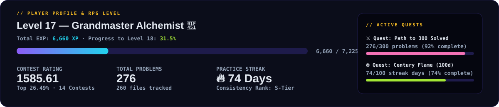
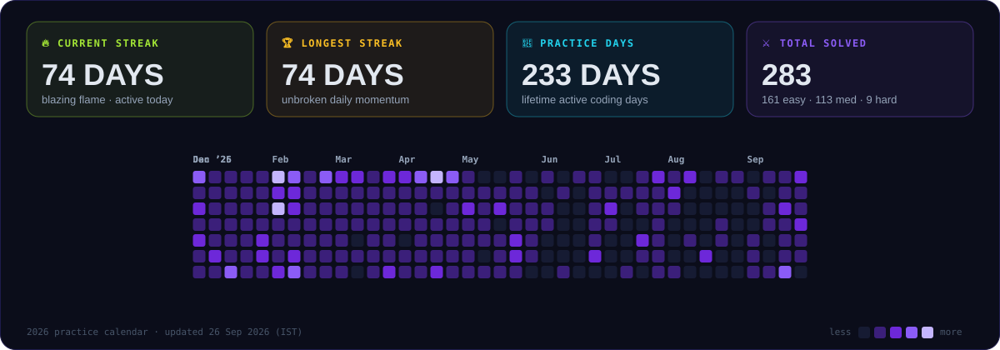
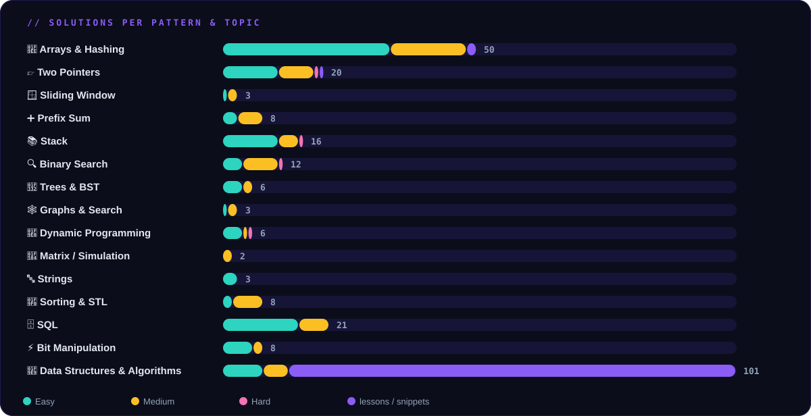

<!-- ⚠️ GENERATED FILE — edit scripts/README.template.md, then run: python scripts/build.py -->

<div align="center">


<br/>

<!-- LeetCode Official Profile & Solved Badges -->
<a href="https://leetcode.com/u/yashyogender/">
  
</a>
<a href="https://leetcode.com/u/yashyogender/">
  
</a>


<br/>

<!-- Streak, Contest Rating & Active Days -->


<br/><br/>

### ▶️ Algorithm Replay — a different one every day



> Not a loop of pictures. The algorithm is really run at build time and every
> comparison, pointer move and window slide it makes becomes a frame. Today it is
> **[#167 Two Sum II - Input Array Is Sorted](https://leetcode.com/problems/two-sum-ii-input-array-is-sorted/)** — Two Pointers, O(n).
> Tomorrow it will be a different one.

<br/>

### 🎮 Player Profile & RPG Stats



<br/>

**Jump directly to:**
<a href="#streak-timeline"></a>
&nbsp;
<a href="#topic-matrix"></a>
&nbsp;
<a href="#achievements"></a>
&nbsp;
<a href="#scaffold-cli"></a>

</div>

<br/>

---

<a id="achievements"></a>

## 🏆 Achievements & Badges

| Badge | Title | Requirement | Status |
|:---:|:---|:---|:---:|
| 🛡️ | **Centurion** | Solve 100+ LeetCode problems | **UNLOCKED** ✅ (281/100) |
| ⚔️ | **Double Centurion** | Solve 200+ LeetCode problems | **UNLOCKED** ✅ (281/200) |
| 👑 | **Triple Centurion** | Solve 300+ LeetCode problems | 🟡 In Progress (281/300 · 94%) |
| 🔒 | **Five Hundred Club** | Solve 500+ LeetCode problems | 🟡 In Progress (281/500 · 56%) |
| 🔥 | **Habit Locked** | Maintain a 30-Day continuous streak | **UNLOCKED** ✅ (74/30) |
| ⚡ | **Pyromancer** | Maintain a 50-Day continuous streak | **UNLOCKED** ✅ (74/50) |
| 🌟 | **Century Flame** | Maintain a 100-Day continuous streak | 🟡 In Progress (74/100 · 74%) |
| 🗄️ | **SQL Sorcerer** | Solve 15+ SQL problems & lessons | **UNLOCKED** ✅ |
| 🌲 | **Tree Whisperer** | Solve 15+ Tree & BST challenges | **UNLOCKED** ✅ |
| 🕸️ | **Graph Conqueror** | Solve 10+ Graph & Search algorithms | **UNLOCKED** ✅ |
| 🥊 | **Contest Gladiator** | Participate in 10+ official contests | **UNLOCKED** ✅ (14 contests) |

<br/>

### ⚔️ The Daily Creed
> *"We do not rise to the level of our goals, we fall to the level of our daily systems."*  
> **74 consecutive days of practice.** One problem solved, one pattern mastered, one commit pushed.

### 🎯 Active Quests & Milestones
* 🗡️ **Daily Quest — Forge the Strike**: Solve at least 1 problem and push your code today. *(Reward: +25 EXP · Streak Shield)*
* 👹 **Weekly Boss — Contest Titan**: Compete in the official LeetCode Weekly / Biweekly Contest. *(Reward: +100 EXP · Rating Boost)*
* 🏆 **Epic Milestone — Triple Centurion**: Reach 300 problems solved (currently 281/300 · only 19 remaining!). *(Reward: +250 EXP · Title: Algorithm Warlord)*

<br/>

---

<a id="streak-timeline"></a>

## 🔥 Streak & 2026 Calendar



> 💡 **Streak Rule:** A day counts if at least one solution or algorithm lesson was written. Streaks and dates are synced in Indian Standard Time (IST).

### 📅 Chronological Timeline

All solutions are filed chronologically under `YYYY/MM-Month/DD-MM-YY/`. ↺ marks a revisit.

```text
📅 dates/
├── 2026/  ·  254 solutions · 81 practice days
│   ├── Sep  ██████                22 solutions · 10 days
│   ├── Aug  ███                   12 solutions · 4 days
│   ├── Jul  ████                  15 solutions · 7 days
│   ├── Jun  ██████████████████    68 solutions · 3 days
│   ├── May  ██████                21 solutions · 11 days
│   ├── Apr  █████                 19 solutions · 10 days
│   ├── Mar  ████                  15 solutions · 11 days
│   ├── Feb  ████████████████████  76 solutions · 19 days
│   └── Jan  ██                     6 solutions · 6 days
└── 2025/  ·  5 solutions · 4 practice days
    ├── Dec  █                      4 solutions · 3 days
    └── Aug  █                      1 solution  · 1 day
```

<details open>
<summary><b>September 2026</b> — 22 solutions across 10 days</summary>

| Date | Problem / Lesson | Topic / Pattern | Diff | Code |
|:--|:--|:--|:-:|:-:|
| **22 Sep** (Tue) | 1283. [Find the Smallest Divisor Given a Threshold](https://leetcode.com/problems/find-the-smallest-divisor-given-a-threshold/) | Binary Search | 🟡 Medium | [Python](2026/09-September/22-09-26/1283-find-the-smallest-divisor-given-a-threshold.py) |
| **21 Sep** (Mon) | 875. [Koko Eating Bananas](https://leetcode.com/problems/koko-eating-bananas/) | Binary Search | 🟡 Medium | [Python](2026/09-September/21-09-26/0875-koko-eating-bananas.py) |
|  | 1482. [Minimum Number of Days to Make m Bouquets](https://leetcode.com/problems/minimum-number-of-days-to-make-m-bouquets/) | Binary Search | 🟡 Medium | [Python](2026/09-September/21-09-26/1482-minimum-number-of-days-to-make-m-bouquets.py) |
|  | 2553. [Separate the Digits in an Array](https://leetcode.com/problems/separate-the-digits-in-an-array/) | Data Structures & Algorithms | 🟢 Easy | [Python](2026/09-September/21-09-26/2553-separate-the-digits-in-an-array.py) |
| **20 Sep** (Sun) | 1047. [Remove All Adjacent Duplicates In String](https://leetcode.com/problems/remove-all-adjacent-duplicates-in-string/) ↺ *revisit* | Stack | 🟢 Easy | [Python](2026/09-September/20-09-26/1047-remove-all-adjacent-duplicates-in-string.py) |
|  | 3498. [Reverse Degree of a String](https://leetcode.com/problems/reverse-degree-of-a-string/) | Strings | 🟢 Easy | [Python](2026/09-September/20-09-26/3498-reverse-degree-of-a-string.py) |
| **19 Sep** (Sat) | 54. [Spiral Matrix](https://leetcode.com/problems/spiral-matrix/) | Matrix / Simulation | 🟡 Medium | [Python](2026/09-September/19-09-26/0054-spiral-matrix.py) |
|  | 443. [String Compression](https://leetcode.com/problems/string-compression/) | Two Pointers | 🟡 Medium | [Python](2026/09-September/19-09-26/0443-string-compression.py) |
|  | 1047. [Remove All Adjacent Duplicates In String](https://leetcode.com/problems/remove-all-adjacent-duplicates-in-string/) | Stack | 🟢 Easy | [Python](2026/09-September/20-09-26/1047-remove-all-adjacent-duplicates-in-string.py) |
|  | [String Building](2026/09-September/19-09-26/string-building.py) | Data Structures & Algorithms | 🟡 Medium | [Python](2026/09-September/19-09-26/string-building.py) |
| **18 Sep** (Fri) | 48. [Rotate Image](https://leetcode.com/problems/rotate-image/) | Matrix / Simulation | 🟡 Medium | [Python](2026/09-September/18-09-26/0048-rotate-image.py) |
|  | 73. [Set Matrix Zeroes](https://leetcode.com/problems/set-matrix-zeroes/) | Arrays & Hashing | 🟡 Medium | [Python](2026/09-September/18-09-26/0073-set-matrix-zeroes.py) |
| **16 Sep** (Wed) | 2149. [Rearrange Array Elements by Sign](https://leetcode.com/problems/rearrange-array-elements-by-sign/) | Two Pointers | 🟡 Medium | [Python](2026/09-September/16-09-26/2149-rearrange-array-elements-by-sign.py) |
| **15 Sep** (Tue) | 56. [Merge Intervals](https://leetcode.com/problems/merge-intervals/) | Sorting & STL | 🟡 Medium | [Python](2026/09-September/15-09-26/0056-merge-intervals.py) |
|  | 179. [Largest Number](https://leetcode.com/problems/largest-number/) | Sorting & STL | 🟡 Medium | [Python](2026/09-September/15-09-26/0179-largest-number.py) |
|  | 1287. [Element Appearing More Than 25% In Sorted Array](https://leetcode.com/problems/element-appearing-more-than-25-in-sorted-array/) | Arrays & Hashing | 🟢 Easy | [Python](2026/09-September/15-09-26/1287-element-appearing-more-than-25-in-sorted-array.py) |
| **12 Sep** (Sat) | 380. [Insert Delete GetRandom O(1)](https://leetcode.com/problems/insert-delete-getrandom-o1/) | Arrays & Hashing | 🟡 Medium | [Python](2026/09-September/14-09-26/0380-insert-delete-getrandom-o1.py) |
|  | [Frequency Count](2026/09-September/12-09-26/frequency-count.py) | Data Structures & Algorithms | 🟡 Medium | [Python](2026/09-September/12-09-26/frequency-count.py) |
|  | [Hashing](2026/09-September/12-09-26/hashing.py) | Arrays & Hashing | 🟡 Medium | [Python](2026/09-September/12-09-26/hashing.py) |
| **05 Sep** (Sat) | 560. [Subarray Sum Equals K](https://leetcode.com/problems/subarray-sum-equals-k/) | Prefix Sum | 🟡 Medium | [Python](2026/09-September/05-09-26/0560-subarray-sum-equals-k.py) |
|  | 974. [Subarray Sums Divisible by K](https://leetcode.com/problems/subarray-sums-divisible-by-k/) | Prefix Sum | 🟡 Medium | [Python](2026/09-September/05-09-26/0974-subarray-sums-divisible-by-k.py) |
| **04 Sep** (Fri) | 303. [Range Sum Query - Immutable](https://leetcode.com/problems/range-sum-query-immutable/) | Prefix Sum | 🟢 Easy | [Python](2026/09-September/04-09-26/0303-range-sum-query-immutable.py) |

</details>

<details>
<summary><b>August 2026</b> — 12 solutions across 4 days</summary>

| Date | Problem / Lesson | Topic / Pattern | Diff | Code |
|:--|:--|:--|:-:|:-:|
| **20 Aug** (Thu) | 15. [3Sum](https://leetcode.com/problems/3sum/) | Two Pointers | 🟡 Medium | [Python](2026/08-August/20-08-26/0015-3sum.py) |
| **19 Aug** (Wed) | 11. [Container With Most Water](https://leetcode.com/problems/container-with-most-water/) | Two Pointers | 🟡 Medium | [Python](2026/08-August/19-08-26/0011-container-with-most-water.py) |
| **16 Aug** (Sun) | 128. [Longest Consecutive Sequence](https://leetcode.com/problems/longest-consecutive-sequence/) | Arrays & Hashing | 🟡 Medium | [Python](2026/08-August/16-08-26/0128-longest-consecutive-sequence.py) |
|  | 347. [Top K Frequent Elements](https://leetcode.com/problems/top-k-frequent-elements/) | Arrays & Hashing | 🟡 Medium | [Python](2026/08-August/16-08-26/0347-top-k-frequent-elements.py) |
| **14 Aug** (Fri) | 1. [Two Sum](https://leetcode.com/problems/two-sum/) | Arrays & Hashing | 🟢 Easy | [Python](2026/08-August/14-08-26/0001-two-sum.py) |
|  | 2. [Add Two Numbers](https://leetcode.com/problems/add-two-numbers/) | Math & Logic | 🟡 Medium | [Python](2026/08-August/14-08-26/0002-add-two-numbers.py) |
|  | 3. [Longest Substring Without Repeating Characters](https://leetcode.com/problems/longest-substring-without-repeating-characters/) | Sliding Window | 🟡 Medium | [Python](2026/08-August/14-08-26/0003-longest-substring-without-repeating-characters.py) |
|  | 4. [Median of Two Sorted Arrays](https://leetcode.com/problems/median-of-two-sorted-arrays/) | Binary Search | 🔴 Hard | [Python](2026/08-August/14-08-26/0004-median-of-two-sorted-arrays.py) |
|  | 49. [Group Anagrams](https://leetcode.com/problems/group-anagrams/) | Hash Map with sorted-string key | 🟡 Medium | [Python](2026/08-August/14-08-26/0049-group-anagrams.py) |
|  | 217. [Contains Duplicate](https://leetcode.com/problems/contains-duplicate/) | Hash Map (frequency) | 🟢 Easy | [Python](2026/08-August/14-08-26/0217-contains-duplicate.py) |
|  | 242. [Valid Anagram](https://leetcode.com/problems/valid-anagram/) | Hashing / Counting | 🟢 Easy | [Python](2026/08-August/14-08-26/0242-valid-anagram.py) |
|  | [Without TLE](2026/08-August/14-08-26/without-tle.py) | Arrays & Hashing | 🟡 Medium | [Python](2026/08-August/14-08-26/without-tle.py) |

</details>

<details>
<summary><b>July 2026</b> — 15 solutions across 7 days</summary>

| Date | Problem / Lesson | Topic / Pattern | Diff | Code |
|:--|:--|:--|:-:|:-:|
| **29 Jul** (Wed) | 31. [Next Permutation](https://leetcode.com/problems/next-permutation/) | Arrays & Hashing | 🟡 Medium | [C++](2026/07-July/29-07-26/0031-next-permutation.cpp) |
|  | [Basics](2026/07-July/29-07-26/basics.py) | Data Structures & Algorithms | 🟡 Medium | [Python](2026/07-July/29-07-26/basics.py) |
|  | [Kmp Pattern Search](2026/07-July/29-07-26/kmp-pattern-search.cpp) | Data Structures & Algorithms | 🟡 Medium | [C++](2026/07-July/29-07-26/kmp-pattern-search.cpp) |
|  | [Naive Pattern Search](2026/07-July/29-07-26/naive-pattern-search.cpp) | Data Structures & Algorithms | 🟡 Medium | [C++](2026/07-July/29-07-26/naive-pattern-search.cpp) |
|  | [Partition Zeros](2026/07-July/29-07-26/partition-zeros.cpp) | Data Structures & Algorithms | 🟡 Medium | [C++](2026/07-July/29-07-26/partition-zeros.cpp) |
|  | [Sort Vs Stable Sort](2026/07-July/29-07-26/sort-vs-stable-sort.cpp) | Data Structures & Algorithms | 🟡 Medium | [C++](2026/07-July/29-07-26/sort-vs-stable-sort.cpp) |
|  | [String Basics](2026/07-July/29-07-26/string-basics.cpp) | Data Structures & Algorithms | 🟡 Medium | [C++](2026/07-July/29-07-26/string-basics.cpp) |
| **28 Jul** (Tue) | 1. [Two Sum](https://leetcode.com/problems/two-sum/) | Sorting + Two Pointers | 🟢 Easy | [Python](2026/07-July/28-07-26/0001-two-sum.py) |
| **17 Jul** (Fri) | 180. [Consecutive Numbers](https://leetcode.com/problems/consecutive-numbers/) | SQL | 🟡 Medium | [SQL](2026/07-July/17-07-26/0180-consecutive-numbers.sql) |
|  | 610. [Triangle Judgement](https://leetcode.com/problems/triangle-judgement/) | SQL | 🟢 Easy | [SQL](2026/07-July/17-07-26/0610-triangle-judgement.sql) |
|  | 1789. [Primary Department for Each Employee](https://leetcode.com/problems/primary-department-for-each-employee/) | SQL | 🟢 Easy | [SQL](2026/07-July/17-07-26/1789-primary-department-for-each-employee.sql) |
| **16 Jul** (Thu) | 619. [Biggest Single Number](https://leetcode.com/problems/biggest-single-number/) | SQL | 🟢 Easy | [SQL](2026/07-July/16-07-26/0619-biggest-single-number.sql) |
| **14 Jul** (Tue) | 1070. [Product Sales Analysis III](https://leetcode.com/problems/product-sales-analysis-iii/) | SQL | 🟡 Medium | [SQL](2026/07-July/14-07-26/1070-product-sales-analysis-iii.sql) |
| **12 Jul** (Sun) | 1141. [User Activity for the Past 30 Days I](https://leetcode.com/problems/user-activity-for-the-past-30-days-i/) | SQL | 🟢 Easy | [SQL](2026/07-July/12-07-26/1141-user-activity-for-the-past-30-days-i.sql) |
| **11 Jul** (Sat) | 550. [Game Play Analysis IV](https://leetcode.com/problems/game-play-analysis-iv/) | SQL | 🟡 Medium | [SQL](2026/07-July/11-07-26/0550-game-play-analysis-iv.sql) |

</details>

<details>
<summary><b>June 2026</b> — 68 solutions across 3 days</summary>

| Date | Problem / Lesson | Topic / Pattern | Diff | Code |
|:--|:--|:--|:-:|:-:|
| **26 Jun** (Fri) | 1. [Two Sum](https://leetcode.com/problems/two-sum/) | Arrays & Hashing | 🟢 Easy | [C++](2026/06-June/26-06-26/0001-two-sum.cpp) |
|  | 26. [Remove Duplicates from Sorted Array](https://leetcode.com/problems/remove-duplicates-from-sorted-array/) | Arrays & Hashing | 🟢 Easy | [C++](2026/06-June/26-06-26/0026-remove-duplicates-from-sorted-array.cpp) |
|  | 53. [Maximum Subarray](https://leetcode.com/problems/maximum-subarray/) | Arrays & Hashing | 🟡 Medium | [C++](2026/06-June/26-06-26/0053-maximum-subarray.cpp) |
|  | 69. [Sqrt(x)](https://leetcode.com/problems/sqrtx/) | Binary Search | 🟢 Easy | [C++](2026/06-June/26-06-26/0069-sqrtx.cpp) |
|  | 83. [Remove Duplicates from Sorted List](https://leetcode.com/problems/remove-duplicates-from-sorted-list/) | Data Structures & Algorithms | 🟢 Easy | [C++](2026/06-June/26-06-26/0083-remove-duplicates-from-sorted-list.cpp) |
|  | 88. [Merge Sorted Array](https://leetcode.com/problems/merge-sorted-array/) | Two Pointers | 🟢 Easy | [C++](2026/06-June/26-06-26/0088-merge-sorted-array.cpp) |
|  | 94. [Binary Tree Inorder Traversal](https://leetcode.com/problems/binary-tree-inorder-traversal/) | Stack | 🟢 Easy | [C++](2026/06-June/26-06-26/0094-binary-tree-inorder-traversal.cpp) |
|  | 100. [Same Tree](https://leetcode.com/problems/same-tree/) | Trees & BST | 🟢 Easy | [C++](2026/06-June/26-06-26/0100-same-tree.cpp) |
|  | 104. [Maximum Depth of Binary Tree](https://leetcode.com/problems/maximum-depth-of-binary-tree/) | Trees & BST | 🟢 Easy | [C++](2026/06-June/26-06-26/0104-maximum-depth-of-binary-tree.cpp) |
|  | 121. [Best Time to Buy and Sell Stock](https://leetcode.com/problems/best-time-to-buy-and-sell-stock/) | Dynamic Programming | 🟢 Easy | [C++](2026/06-June/26-06-26/0121-best-time-to-buy-and-sell-stock.cpp) |
|  | 144. [Binary Tree Preorder Traversal](https://leetcode.com/problems/binary-tree-preorder-traversal/) | Stack | 🟢 Easy | [C++](2026/06-June/26-06-26/0144-binary-tree-preorder-traversal.cpp) |
|  | 145. [Binary Tree Postorder Traversal](https://leetcode.com/problems/binary-tree-postorder-traversal/) | Stack | 🟢 Easy | [C++](2026/06-June/26-06-26/0145-binary-tree-postorder-traversal.cpp) |
|  | 205. [Isomorphic Strings](https://leetcode.com/problems/isomorphic-strings/) | Arrays & Hashing | 🟢 Easy | [C++](2026/06-June/26-06-26/0205-isomorphic-strings.cpp) |
|  | 217. [Contains Duplicate](https://leetcode.com/problems/contains-duplicate/) | Arrays & Hashing | 🟢 Easy | [C++](2026/06-June/26-06-26/0217-contains-duplicate.cpp) |
|  | 219. [Contains Duplicate II](https://leetcode.com/problems/contains-duplicate-ii/) | Arrays & Hashing | 🟢 Easy | [C++](2026/06-June/26-06-26/0219-contains-duplicate-ii.cpp) |
|  | 283. [Move Zeroes](https://leetcode.com/problems/move-zeroes/) | Two Pointers | 🟢 Easy | [C++](2026/06-June/26-06-26/0283-move-zeroes.cpp) |
|  | 303. [Range Sum Query - Immutable](https://leetcode.com/problems/range-sum-query-immutable/) | Arrays & Hashing | 🟢 Easy | [C++](2026/06-June/26-06-26/0303-range-sum-query-immutable.cpp) |
|  | 349. [Intersection of Two Arrays](https://leetcode.com/problems/intersection-of-two-arrays/) | Two Pointers | 🟢 Easy | [C++](2026/06-June/26-06-26/0349-intersection-of-two-arrays.cpp) |
|  | 383. [Ransom Note](https://leetcode.com/problems/ransom-note/) | Arrays & Hashing | 🟢 Easy | [C++](2026/06-June/26-06-26/0383-ransom-note.cpp) |
|  | 387. [First Unique Character in a String](https://leetcode.com/problems/first-unique-character-in-a-string/) | Arrays & Hashing | 🟢 Easy | [C++](2026/06-June/26-06-26/0387-first-unique-character-in-a-string.cpp) |
|  | 389. [Find the Difference](https://leetcode.com/problems/find-the-difference/) | Arrays & Hashing | 🟢 Easy | [C++](2026/06-June/26-06-26/0389-find-the-difference.cpp) |
|  | 414. [Third Maximum Number](https://leetcode.com/problems/third-maximum-number/) | Sorting & STL | 🟢 Easy | [C++](2026/06-June/26-06-26/0414-third-maximum-number.cpp) |
|  | 448. [Find All Numbers Disappeared in an Array](https://leetcode.com/problems/find-all-numbers-disappeared-in-an-array/) | Arrays & Hashing | 🟢 Easy | [C++](2026/06-June/26-06-26/0448-find-all-numbers-disappeared-in-an-array.cpp) |
|  | 485. [Max Consecutive Ones](https://leetcode.com/problems/max-consecutive-ones/) | Arrays & Hashing | 🟢 Easy | [C++](2026/06-June/26-06-26/0485-max-consecutive-ones.cpp) |
|  | 643. [Maximum Average Subarray I](https://leetcode.com/problems/maximum-average-subarray-i/) | Arrays & Hashing | 🟢 Easy | [C++](2026/06-June/26-06-26/0643-maximum-average-subarray-i.cpp) |
|  | 645. [Set Mismatch](https://leetcode.com/problems/set-mismatch/) | Arrays & Hashing | 🟢 Easy | [C++](2026/06-June/26-06-26/0645-set-mismatch.cpp) |
|  | 704. [Binary Search](https://leetcode.com/problems/binary-search/) | Arrays & Hashing | 🟢 Easy | [C++](2026/06-June/26-06-26/0704-binary-search.cpp) |
|  | 728. [Self Dividing Numbers](https://leetcode.com/problems/self-dividing-numbers/) | Arrays & Hashing | 🟢 Easy | [C++](2026/06-June/26-06-26/0728-self-dividing-numbers.cpp) |
|  | 796. [Rotate String](https://leetcode.com/problems/rotate-string/) | Arrays & Hashing | 🟢 Easy | [C++](2026/06-June/26-06-26/0796-rotate-string.cpp) |
|  | 1021. [Remove Outermost Parentheses](https://leetcode.com/problems/remove-outermost-parentheses/) | Arrays & Hashing | 🟢 Easy | [C++](2026/06-June/26-06-26/1021-remove-outermost-parentheses.cpp) |
|  | 1174. [Immediate Food Delivery II](https://leetcode.com/problems/immediate-food-delivery-ii/) | Arrays & Hashing | 🟡 Medium | [C++](2026/06-June/26-06-26/1174-immediate-food-delivery-ii.cpp) |
|  | 1193. [Monthly Transactions I](https://leetcode.com/problems/monthly-transactions-i/) | Arrays & Hashing | 🟡 Medium | [C++](2026/06-June/26-06-26/1193-monthly-transactions-i.cpp) |
|  | 1365. [How Many Numbers Are Smaller Than the Current Number](https://leetcode.com/problems/how-many-numbers-are-smaller-than-the-current-number/) | Arrays & Hashing | 🟢 Easy | [C++](2026/06-June/26-06-26/1365-how-many-numbers-are-smaller-than-the-current-number.cpp) |
|  | 1470. [Shuffle the Array](https://leetcode.com/problems/shuffle-the-array/) | Arrays & Hashing | 🟢 Easy | [C++](2026/06-June/26-06-26/1470-shuffle-the-array.cpp) |
|  | 1539. [Kth Missing Positive Number](https://leetcode.com/problems/kth-missing-positive-number/) | Arrays & Hashing | 🟢 Easy | [C++](2026/06-June/26-06-26/1539-kth-missing-positive-number.cpp) |
|  | 1752. [Check if Array Is Sorted and Rotated](https://leetcode.com/problems/check-if-array-is-sorted-and-rotated/) | Arrays & Hashing | 🟢 Easy | [C++](2026/06-June/26-06-26/1752-check-if-array-is-sorted-and-rotated.cpp) |
|  | 1929. [Concatenation of Array](https://leetcode.com/problems/concatenation-of-array/) | Arrays & Hashing | 🟢 Easy | [C++](2026/06-June/26-06-26/1929-concatenation-of-array.cpp) |
|  | 2356. [Number of Unique Subjects Taught by Each Teacher](https://leetcode.com/problems/number-of-unique-subjects-taught-by-each-teacher/) | Arrays & Hashing | 🟢 Easy | [C++](2026/06-June/26-06-26/2356-number-of-unique-subjects-taught-by-each-teacher.cpp) |
|  | 3314. [Construct the Minimum Bitwise Array I](https://leetcode.com/problems/construct-the-minimum-bitwise-array-i/) | Bit Manipulation | 🟢 Easy | [C++](2026/06-June/26-06-26/3314-construct-the-minimum-bitwise-array-i.cpp) |
|  | [Arrays](2026/06-June/26-06-26/arrays.cpp) | Data Structures & Algorithms | 🟡 Medium | [C++](2026/06-June/26-06-26/arrays.cpp) |
|  | [Basic](2026/06-June/26-06-26/basic.cpp) | Data Structures & Algorithms | 🟡 Medium | [C++](2026/06-June/26-06-26/basic.cpp) |
|  | [Basic Recursion](2026/06-June/26-06-26/basic-recursion.cpp) | Data Structures & Algorithms | 🟡 Medium | [C++](2026/06-June/26-06-26/basic-recursion.cpp) |
|  | [Binary Tree](2026/06-June/26-06-26/binary-tree.cpp) | Data Structures & Algorithms | 🟡 Medium | [C++](2026/06-June/26-06-26/binary-tree.cpp) |
|  | [Bst Deletion](2026/06-June/26-06-26/bst-deletion.cpp) | Data Structures & Algorithms | 🟡 Medium | [C++](2026/06-June/26-06-26/bst-deletion.cpp) |
|  | [Bst Insertion](2026/06-June/26-06-26/bst-insertion.cpp) | Data Structures & Algorithms | 🟡 Medium | [C++](2026/06-June/26-06-26/bst-insertion.cpp) |
|  | [Bst Traversal](2026/06-June/26-06-26/bst-traversal.cpp) | Data Structures & Algorithms | 🟡 Medium | [C++](2026/06-June/26-06-26/bst-traversal.cpp) |
|  | [Bubblesort](2026/06-June/26-06-26/bubblesort.cpp) | Data Structures & Algorithms | 🟡 Medium | [C++](2026/06-June/26-06-26/bubblesort.cpp) |
|  | [Creation](2026/06-June/26-06-26/creation.cpp) | Data Structures & Algorithms | 🟡 Medium | [C++](2026/06-June/26-06-26/creation.cpp) |
|  | [H1](2026/06-June/26-06-26/h1.cpp) | Data Structures & Algorithms | 🟡 Medium | [C++](2026/06-June/26-06-26/h1.cpp) |
|  | [Insertion Sorting](2026/06-June/26-06-26/insertion-sorting.cpp) | Data Structures & Algorithms | 🟡 Medium | [C++](2026/06-June/26-06-26/insertion-sorting.cpp) |
|  | [Main](2026/06-June/26-06-26/main.cpp) | Data Structures & Algorithms | 🟡 Medium | [C++](2026/06-June/26-06-26/main.cpp) |
|  | [Mapping Sets](2026/06-June/26-06-26/mapping-sets.cpp) | Data Structures & Algorithms | 🟡 Medium | [C++](2026/06-June/26-06-26/mapping-sets.cpp) |
|  | [Merge Sort](2026/06-June/26-06-26/merge-sort.cpp) | Data Structures & Algorithms | 🟡 Medium | [C++](2026/06-June/26-06-26/merge-sort.cpp) |
|  | [Numpy Demo](2026/06-June/26-06-26/numpy-demo.py) | Data Structures & Algorithms | 🟡 Medium | [Python](2026/06-June/26-06-26/numpy-demo.py) |
|  | [Opencv Image To Array](2026/06-June/26-06-26/opencv-image-to-array.py) | Data Structures & Algorithms | 🟡 Medium | [Python](2026/06-June/26-06-26/opencv-image-to-array.py) |
|  | [Producer](2026/06-June/26-06-26/producer.py) | Data Structures & Algorithms | 🟡 Medium | [Python](2026/06-June/26-06-26/producer.py) |
|  | [Python Case2 Is Wrong](2026/06-June/26-06-26/python-case2-is-wrong.cpp) | Data Structures & Algorithms | 🟡 Medium | [C++](2026/06-June/26-06-26/python-case2-is-wrong.cpp) |
|  | [Q1. Best Reachable Tower©Leetcode(17 01)](2026/06-June/26-06-26/q1-best-reachable-tower-leetcode-17-01.cpp) | Data Structures & Algorithms | 🟡 Medium | [C++](2026/06-June/26-06-26/q1-best-reachable-tower-leetcode-17-01.cpp) |
|  | [Quick Sort](2026/06-June/26-06-26/quick-sort.cpp) | Data Structures & Algorithms | 🟡 Medium | [C++](2026/06-June/26-06-26/quick-sort.cpp) |
|  | [Secondlargest](2026/06-June/26-06-26/secondlargest.cpp) | Data Structures & Algorithms | 🟡 Medium | [C++](2026/06-June/26-06-26/secondlargest.cpp) |
|  | [Selection Sort](2026/06-June/26-06-26/selection-sort.cpp) | Data Structures & Algorithms | 🟡 Medium | [C++](2026/06-June/26-06-26/selection-sort.cpp) |
|  | [Selectionsorting](2026/06-June/26-06-26/selectionsorting.cpp) | Data Structures & Algorithms | 🟡 Medium | [C++](2026/06-June/26-06-26/selectionsorting.cpp) |
|  | [Stack](2026/06-June/26-06-26/stack.cpp) | Data Structures & Algorithms | 🟡 Medium | [C++](2026/06-June/26-06-26/stack.cpp) |
|  | [String](2026/06-June/26-06-26/string.py) | Data Structures & Algorithms | 🟡 Medium | [Python](2026/06-June/26-06-26/string.py) |
|  | [Trees](2026/06-June/26-06-26/trees.cpp) | Data Structures & Algorithms | 🟡 Medium | [C++](2026/06-June/26-06-26/trees.cpp) |
|  | [Treesmaster](2026/06-June/26-06-26/treesmaster.cpp) | Data Structures & Algorithms | 🟡 Medium | [C++](2026/06-June/26-06-26/treesmaster.cpp) |
| **23 Jun** (Tue) | [Array Searching](2026/06-June/23-06-26/array-searching.cpp) | Data Structures & Algorithms | 🟡 Medium | [C++](2026/06-June/23-06-26/array-searching.cpp) |
| **18 Jun** (Thu) | [Two Pointer](2026/06-June/18-06-26/two-pointer.cpp) | Data Structures & Algorithms | 🟡 Medium | [C++](2026/06-June/18-06-26/two-pointer.cpp) |

</details>

<details>
<summary><b>May 2026</b> — 21 solutions across 11 days</summary>

| Date | Problem / Lesson | Topic / Pattern | Diff | Code |
|:--|:--|:--|:-:|:-:|
| **26 May** (Tue) | [Prefix](2026/05-May/26-05-26/prefix.cpp) | Data Structures & Algorithms | 🟡 Medium | [C++](2026/05-May/26-05-26/prefix.cpp) |
| **22 May** (Fri) | 570. [Managers with at Least 5 Direct Reports](https://leetcode.com/problems/managers-with-at-least-5-direct-reports/) | SQL | 🟡 Medium | [SQL](2026/05-May/22-05-26/0570-managers-with-at-least-5-direct-reports.sql) |
|  | 1075. [Project Employees I](https://leetcode.com/problems/project-employees-i/) | SQL | 🟢 Easy | [SQL](2026/05-May/22-05-26/1075-project-employees-i.sql) |
|  | 1193. [Monthly Transactions I](https://leetcode.com/problems/monthly-transactions-i/) | SQL | 🟡 Medium | [SQL](2026/05-May/22-05-26/1193-monthly-transactions-i.sql) |
|  | 1211. [Queries Quality and Percentage](https://leetcode.com/problems/queries-quality-and-percentage/) | SQL | 🟢 Easy | [SQL](2026/05-May/22-05-26/1211-queries-quality-and-percentage.sql) |
|  | 1251. [Average Selling Price](https://leetcode.com/problems/average-selling-price/) | SQL | 🟢 Easy | [SQL](2026/05-May/22-05-26/1251-average-selling-price.sql) |
|  | 1633. [Percentage of Users Attended a Contest](https://leetcode.com/problems/percentage-of-users-attended-a-contest/) | SQL | 🟢 Easy | [SQL](2026/05-May/22-05-26/1633-percentage-of-users-attended-a-contest.sql) |
|  | 1934. [Confirmation Rate](https://leetcode.com/problems/confirmation-rate/) | SQL | 🟡 Medium | [SQL](2026/05-May/22-05-26/1934-confirmation-rate.sql) |
| **21 May** (Thu) | 577. [Employee Bonus](https://leetcode.com/problems/employee-bonus/) | SQL | 🟢 Easy | [SQL](2026/05-May/21-05-26/0577-employee-bonus.sql) |
|  | 1661. [Average Time of Process per Machine](https://leetcode.com/problems/average-time-of-process-per-machine/) | SQL | 🟢 Easy | [SQL](2026/05-May/21-05-26/1661-average-time-of-process-per-machine.sql) |
| **20 May** (Wed) | 15. [3Sum](https://leetcode.com/problems/3sum/) | Two Pointers | 🟡 Medium | [C++](2026/05-May/20-05-26/0015-3sum.cpp) |
|  | 167. [Two Sum II - Input Array Is Sorted](https://leetcode.com/problems/two-sum-ii-input-array-is-sorted/) | Two Pointers | 🟡 Medium | [C++](2026/05-May/20-05-26/0167-two-sum-ii-input-array-is-sorted.cpp) |
| **19 May** (Tue) | [Two Pointer Revision](2026/05-May/19-05-26/revision.cpp) | Two Pointers | 🟡 Medium | [C++](2026/05-May/19-05-26/revision.cpp) |
| **18 May** (Mon) | [Commands](2026/05-May/18-05-26/commands.sql) | Data Structures & Algorithms | 🟡 Medium | [SQL](2026/05-May/18-05-26/commands.sql) |
|  | [Dijkstra](2026/05-May/18-05-26/dijkstra.cpp) | Data Structures & Algorithms | 🟡 Medium | [C++](2026/05-May/18-05-26/dijkstra.cpp) |
| **17 May** (Sun) | 197. [Rising Temperature](https://leetcode.com/problems/rising-temperature/) | SQL | 🟢 Easy | [SQL](2026/05-May/17-05-26/0197-rising-temperature.sql) |
|  | [Commands](2026/05-May/17-05-26/commands.sql) | Data Structures & Algorithms | 🟡 Medium | [SQL](2026/05-May/17-05-26/commands.sql) |
| **15 May** (Fri) | [Commands](2026/05-May/15-05-26/commands.sql) | Data Structures & Algorithms | 🟡 Medium | [SQL](2026/05-May/15-05-26/commands.sql) |
| **09 May** (Sat) | [Queue](2026/05-May/09-05-26/queue.cpp) | Data Structures & Algorithms | 🟡 Medium | [C++](2026/05-May/09-05-26/queue.cpp) |
| **02 May** (Sat) | [Topo Sorting](2026/05-May/02-05-26/topo-sorting.cpp) | Data Structures & Algorithms | 🟡 Medium | [C++](2026/05-May/02-05-26/topo-sorting.cpp) |
| **01 May** (Fri) | [Cycyle Detection Directed](2026/05-May/01-05-26/cycyle-detection-directed.cpp) | Data Structures & Algorithms | 🟡 Medium | [C++](2026/05-May/01-05-26/cycyle-detection-directed.cpp) |

</details>

<details>
<summary><b>April 2026</b> — 19 solutions across 10 days</summary>

| Date | Problem / Lesson | Topic / Pattern | Diff | Code |
|:--|:--|:--|:-:|:-:|
| **22 Apr** (Wed) | [Topological Sort](2026/04-April/22-04-26/topological-sort.cpp) | Data Structures & Algorithms | 🟡 Medium | [C++](2026/04-April/22-04-26/topological-sort.cpp) |
| **21 Apr** (Tue) | [Cycle Detection](2026/04-April/21-04-26/cycle-detection.cpp) | Data Structures & Algorithms | 🟡 Medium | [C++](2026/04-April/21-04-26/cycle-detection.cpp) |
| **18 Apr** (Sat) | 181. [Employees Earning More Than Their Managers](https://leetcode.com/problems/employees-earning-more-than-their-managers/) | SQL | 🟢 Easy | [SQL](2026/04-April/18-04-26/0181-employees-earning-more-than-their-managers.sql) |
|  | 584. [Find Customer Referee](https://leetcode.com/problems/find-customer-referee/) | SQL | 🟢 Easy | [SQL](2026/04-April/18-04-26/0584-find-customer-referee.sql) |
|  | 620. [Not Boring Movies](https://leetcode.com/problems/not-boring-movies/) | SQL | 🟢 Easy | [SQL](2026/04-April/18-04-26/0620-not-boring-movies.sql) |
|  | [Dfs](2026/04-April/18-04-26/dfs.cpp) | Data Structures & Algorithms | 🟡 Medium | [C++](2026/04-April/18-04-26/dfs.cpp) |
| **12 Apr** (Sun) | 175. [Combine Two Tables](https://leetcode.com/problems/combine-two-tables/) | SQL | 🟢 Easy | [SQL](2026/04-April/12-04-26/0175-combine-two-tables.sql) |
|  | 994. [Rotting Oranges](https://leetcode.com/problems/rotting-oranges/) | Graphs & Search | 🟡 Medium | [C++](2026/04-April/12-04-26/0994-rotting-oranges.cpp) |
|  | [Commands](2026/04-April/12-04-26/commands.sql) | Data Structures & Algorithms | 🟡 Medium | [SQL](2026/04-April/12-04-26/commands.sql) |
| **11 Apr** (Sat) | [Commands](2026/04-April/11-04-26/commands.sql) | Data Structures & Algorithms | 🟡 Medium | [SQL](2026/04-April/11-04-26/commands.sql) |
| **10 Apr** (Fri) | 200. [Number of Islands](https://leetcode.com/problems/number-of-islands/) | Graphs & Search | 🟡 Medium | [C++](2026/04-April/10-04-26/0200-number-of-islands.cpp) |
| **09 Apr** (Thu) | 200. [Number of Islands](https://leetcode.com/problems/number-of-islands/) | Arrays & Hashing | 🟡 Medium | [C++](2026/04-April/09-04-26/0200-number-of-islands.cpp) |
|  | [Commands](2026/04-April/09-04-26/commands.sql) | Data Structures & Algorithms | 🟡 Medium | [SQL](2026/04-April/09-04-26/commands.sql) |
|  | [Graph Everything](2026/04-April/09-04-26/graph-everything.cpp) | Data Structures & Algorithms | 🟡 Medium | [C++](2026/04-April/09-04-26/graph-everything.cpp) |
| **08 Apr** (Wed) | [Coversion Matrix To Adjacency](2026/04-April/08-04-26/coversion-matrix-to-adjacency.cpp) | Data Structures & Algorithms | 🟡 Medium | [C++](2026/04-April/08-04-26/coversion-matrix-to-adjacency.cpp) |
| **07 Apr** (Tue) | [Graph Bfs](2026/04-April/07-04-26/graph-bfs.cpp) | Data Structures & Algorithms | 🟡 Medium | [C++](2026/04-April/07-04-26/graph-bfs.cpp) |
|  | [Graph List](2026/04-April/07-04-26/graph-list.cpp) | Data Structures & Algorithms | 🟡 Medium | [C++](2026/04-April/07-04-26/graph-list.cpp) |
|  | [Graph List Weighted](2026/04-April/07-04-26/graph-list-weighted.cpp) | Data Structures & Algorithms | 🟡 Medium | [C++](2026/04-April/07-04-26/graph-list-weighted.cpp) |
| **06 Apr** (Mon) | [Graph Matrix](2026/04-April/06-04-26/graph-matrix.cpp) | Data Structures & Algorithms | 🟡 Medium | [C++](2026/04-April/06-04-26/graph-matrix.cpp) |

</details>

<details>
<summary><b>March 2026</b> — 15 solutions across 11 days</summary>

| Date | Problem / Lesson | Topic / Pattern | Diff | Code |
|:--|:--|:--|:-:|:-:|
| **30 Mar** (Mon) | [Commands](2026/03-March/30-03-26/commands.sql) | Data Structures & Algorithms | 🟡 Medium | [SQL](2026/03-March/30-03-26/commands.sql) |
| **29 Mar** (Sun) | [Commands](2026/03-March/29-03-26/commands.sql) | Data Structures & Algorithms | 🟡 Medium | [SQL](2026/03-March/29-03-26/commands.sql) |
| **27 Mar** (Fri) | [Commands](2026/03-March/27-03-26/commands.sql) | Data Structures & Algorithms | 🟡 Medium | [SQL](2026/03-March/27-03-26/commands.sql) |
| **26 Mar** (Thu) | [Cycle Detection](2026/03-March/26-03-26/cycle-detection.cpp) | Data Structures & Algorithms | 🟡 Medium | [C++](2026/03-March/26-03-26/cycle-detection.cpp) |
| **24 Mar** (Tue) | 1791. [Find Center of Star Graph](https://leetcode.com/problems/find-center-of-star-graph/) | Data Structures & Algorithms | 🟢 Easy | [C++](2026/03-March/24-03-26/1791-find-center-of-star-graph.cpp) |
|  | [Dfs](2026/03-March/24-03-26/dfs.cpp) | Data Structures & Algorithms | 🟡 Medium | [C++](2026/03-March/24-03-26/dfs.cpp) |
| **23 Mar** (Mon) | 1971. [Find if Path Exists in Graph](https://leetcode.com/problems/find-if-path-exists-in-graph/) | Graphs & Search | 🟢 Easy | [C++](2026/03-March/23-03-26/1971-find-if-path-exists-in-graph.cpp) |
|  | [Graphbfs](2026/03-March/23-03-26/graphbfs.cpp) | Data Structures & Algorithms | 🟡 Medium | [C++](2026/03-March/23-03-26/graphbfs.cpp) |
| **22 Mar** (Sun) | [Graph](2026/03-March/22-03-26/graph.cpp) | Data Structures & Algorithms | 🟡 Medium | [C++](2026/03-March/22-03-26/graph.cpp) |
| **08 Mar** (Sun) | [Graph](2026/03-March/08-03-26/graph.cpp) | Data Structures & Algorithms | 🟡 Medium | [C++](2026/03-March/08-03-26/graph.cpp) |
| **06 Mar** (Fri) | [List](2026/03-March/06-03-26/list.cpp) | Data Structures & Algorithms | 🟡 Medium | [C++](2026/03-March/06-03-26/list.cpp) |
| **05 Mar** (Thu) | [Graph List](2026/03-March/05-03-26/graph-list.cpp) | Data Structures & Algorithms | 🟡 Medium | [C++](2026/03-March/05-03-26/graph-list.cpp) |
| **03 Mar** (Tue) | 566. [Reshape the Matrix](https://leetcode.com/problems/reshape-the-matrix/) | Arrays & Hashing | 🟢 Easy | [C++](2026/03-March/03-03-26/0566-reshape-the-matrix.cpp) |
|  | 867. [Transpose Matrix](https://leetcode.com/problems/transpose-matrix/) | Arrays & Hashing | 🟢 Easy | [C++](2026/09-September/17-09-26/0867-transpose-matrix.cpp) |
|  | [2D Matrix](2026/03-March/03-03-26/2d-matrix.cpp) | Data Structures & Algorithms | 🟡 Medium | [C++](2026/03-March/03-03-26/2d-matrix.cpp) |

</details>

<details>
<summary><b>February 2026</b> — 76 solutions across 19 days</summary>

| Date | Problem / Lesson | Topic / Pattern | Diff | Code |
|:--|:--|:--|:-:|:-:|
| **22 Feb** (Sun) | [Inorder](2026/02-February/22-02-26/inorder.cpp) | Data Structures & Algorithms | 🟡 Medium | [C++](2026/02-February/22-02-26/inorder.cpp) |
| **21 Feb** (Sat) | [Graph](2026/02-February/21-02-26/graph.cpp) | Data Structures & Algorithms | 🟡 Medium | [C++](2026/02-February/21-02-26/graph.cpp) |
| **18 Feb** (Wed) | 102. [Binary Tree Level Order Traversal](https://leetcode.com/problems/binary-tree-level-order-traversal/) | Trees & BST | 🟡 Medium | [C++](2026/02-February/18-02-26/0102-binary-tree-level-order-traversal.cpp) |
|  | 236. [Lowest Common Ancestor of a Binary Tree](https://leetcode.com/problems/lowest-common-ancestor-of-a-binary-tree/) | Trees & BST | 🟡 Medium | [C++](2026/02-February/18-02-26/0236-lowest-common-ancestor-of-a-binary-tree.cpp) |
|  | [Inorder](2026/02-February/18-02-26/inorder.cpp) | Data Structures & Algorithms | 🟡 Medium | [C++](2026/02-February/18-02-26/inorder.cpp) |
|  | [Levelorder](2026/02-February/18-02-26/levelorder.cpp) | Data Structures & Algorithms | 🟡 Medium | [C++](2026/02-February/18-02-26/levelorder.cpp) |
|  | [Postorder](2026/02-February/18-02-26/postorder.cpp) | Data Structures & Algorithms | 🟡 Medium | [C++](2026/02-February/18-02-26/postorder.cpp) |
|  | [Preorder](2026/02-February/18-02-26/preorder.cpp) | Data Structures & Algorithms | 🟡 Medium | [C++](2026/02-February/18-02-26/preorder.cpp) |
| **17 Feb** (Tue) | 67. [Add Binary](https://leetcode.com/problems/add-binary/) | Bit Manipulation | 🟢 Easy | [C++](2026/02-February/17-02-26/0067-add-binary.cpp) |
|  | 1441. [Build an Array With Stack Operations](https://leetcode.com/problems/build-an-array-with-stack-operations/) | Stack | 🟡 Medium | [C++](2026/02-February/17-02-26/1441-build-an-array-with-stack-operations.cpp) |
|  | [Bitmanipulation](2026/02-February/17-02-26/bitmanipulation.cpp) | Data Structures & Algorithms | 🟡 Medium | [C++](2026/02-February/17-02-26/bitmanipulation.cpp) |
| **16 Feb** (Mon) | 136. [Single Number](https://leetcode.com/problems/single-number/) | Bit Manipulation | 🟢 Easy | [C++](2026/02-February/16-02-26/0136-single-number.cpp) |
|  | 191. [Number of 1 Bits](https://leetcode.com/problems/number-of-1-bits/) | Bit Manipulation | 🟢 Easy | [C++](2026/02-February/16-02-26/0191-number-of-1-bits.cpp) |
|  | 222. [Count Complete Tree Nodes](https://leetcode.com/problems/count-complete-tree-nodes/) | Binary Search | 🟡 Medium | [C++](2026/02-February/16-02-26/0222-count-complete-tree-nodes.cpp) |
|  | 338. [Counting Bits](https://leetcode.com/problems/counting-bits/) | Dynamic Programming | 🟢 Easy | [C++](2026/02-February/16-02-26/0338-counting-bits.cpp) |
|  | [Bitmanipulation](2026/02-February/16-02-26/bitmanipulation.cpp) | Data Structures & Algorithms | 🟡 Medium | [C++](2026/02-February/16-02-26/bitmanipulation.cpp) |
| **15 Feb** (Sun) | 735. [Asteroid Collision](https://leetcode.com/problems/asteroid-collision/) | Stack | 🟡 Medium | [C++](2026/02-February/15-02-26/0735-asteroid-collision.cpp) |
|  | 739. [Daily Temperatures](https://leetcode.com/problems/daily-temperatures/) | Stack | 🟡 Medium | [C++](2026/02-February/15-02-26/0739-daily-temperatures.cpp) |
|  | [Queue](2026/02-February/15-02-26/queue.cpp) | Data Structures & Algorithms | 🟡 Medium | [C++](2026/02-February/15-02-26/queue.cpp) |
| **14 Feb** (Sat) | 682. [Baseball Game](https://leetcode.com/problems/baseball-game/) | Stack | 🟢 Easy | [C++](2026/02-February/14-02-26/0682-baseball-game.cpp) |
|  | 844. [Backspace String Compare](https://leetcode.com/problems/backspace-string-compare/) | Two Pointers | 🟢 Easy | [C++](2026/02-February/14-02-26/0844-backspace-string-compare.cpp) |
|  | 1475. [Final Prices With a Special Discount in a Shop](https://leetcode.com/problems/final-prices-with-a-special-discount-in-a-shop/) | Stack | 🟢 Easy | [C++](2026/02-February/14-02-26/1475-final-prices-with-a-special-discount-in-a-shop.cpp) |
|  | 1480. [Running Sum of 1d Array](https://leetcode.com/problems/running-sum-of-1d-array/) | Prefix Sum | 🟢 Easy | [C++](2026/09-September/04-09-26/1480-running-sum-of-1d-array.cpp) |
|  | 1598. [Crawler Log Folder](https://leetcode.com/problems/crawler-log-folder/) | Stack | 🟢 Easy | [C++](2026/02-February/14-02-26/1598-crawler-log-folder.cpp) |
|  | 1614. [Maximum Nesting Depth of the Parentheses](https://leetcode.com/problems/maximum-nesting-depth-of-the-parentheses/) | Stack | 🟢 Easy | [C++](2026/02-February/14-02-26/1614-maximum-nesting-depth-of-the-parentheses.cpp) |
|  | 3838. [Weighted Word Mapping](https://leetcode.com/problems/weighted-word-mapping/) | Strings | 🟢 Easy | [C++](2026/02-February/14-02-26/3838-weighted-word-mapping.cpp) |
|  | [Stack](2026/02-February/14-02-26/stack.cpp) | Data Structures & Algorithms | 🟡 Medium | [C++](2026/02-February/14-02-26/stack.cpp) |
| **13 Feb** (Fri) | 215. [Kth Largest Element in an Array](https://leetcode.com/problems/kth-largest-element-in-an-array/) | Sorting & STL | 🟡 Medium | [C++](2026/02-February/13-02-26/0215-kth-largest-element-in-an-array.cpp) |
|  | 912. [Sort an Array](https://leetcode.com/problems/sort-an-array/) | Sorting & STL | 🟡 Medium | [C++](2026/02-February/13-02-26/0912-sort-an-array.cpp) |
|  | 1051. [Height Checker](https://leetcode.com/problems/height-checker/) | Sorting & STL | 🟢 Easy | [C++](2026/02-February/13-02-26/1051-height-checker.cpp) |
|  | [Quicksort](2026/02-February/13-02-26/quicksort.cpp) | Data Structures & Algorithms | 🟡 Medium | [C++](2026/02-February/13-02-26/quicksort.cpp) |
| **12 Feb** (Thu) | 905. [Sort Array By Parity](https://leetcode.com/problems/sort-array-by-parity/) | Two Pointers | 🟢 Easy | [C++](2026/02-February/12-02-26/0905-sort-array-by-parity.cpp) |
|  | 965. [Univalued Binary Tree](https://leetcode.com/problems/univalued-binary-tree/) | Trees & BST | 🟢 Easy | [C++](2026/09-September/10-09-26/0965-univalued-binary-tree.cpp) |
|  | 977. [Squares of a Sorted Array](https://leetcode.com/problems/squares-of-a-sorted-array/) | Two Pointers | 🟢 Easy | [C++](2026/02-February/12-02-26/0977-squares-of-a-sorted-array.cpp) |
|  | [Bubblesort](2026/02-February/12-02-26/bubblesort.cpp) | Data Structures & Algorithms | 🟡 Medium | [C++](2026/02-February/12-02-26/bubblesort.cpp) |
|  | [Insertionsort](2026/02-February/12-02-26/insertionsort.cpp) | Data Structures & Algorithms | 🟡 Medium | [C++](2026/02-February/12-02-26/insertionsort.cpp) |
|  | [Mergesort](2026/02-February/12-02-26/mergesort.cpp) | Data Structures & Algorithms | 🟡 Medium | [C++](2026/02-February/12-02-26/mergesort.cpp) |
|  | [Quicksort](2026/02-February/12-02-26/quicksort.cpp) | Data Structures & Algorithms | 🟡 Medium | [C++](2026/02-February/12-02-26/quicksort.cpp) |
|  | [Selectionsort](2026/02-February/12-02-26/selectionsort.cpp) | Data Structures & Algorithms | 🟡 Medium | [C++](2026/02-February/12-02-26/selectionsort.cpp) |
| **11 Feb** (Wed) | 32. [Longest Valid Parentheses](https://leetcode.com/problems/longest-valid-parentheses/) | Stack | 🔴 Hard | [C++](2026/02-February/11-02-26/0032-longest-valid-parentheses.cpp) |
|  | 950. [Reveal Cards In Increasing Order](https://leetcode.com/problems/reveal-cards-in-increasing-order/) | Sorting & STL | 🟡 Medium | [C++](2026/02-February/11-02-26/0950-reveal-cards-in-increasing-order.cpp) |
| **10 Feb** (Tue) | 20. [Valid Parentheses](https://leetcode.com/problems/valid-parentheses/) | Stack | 🟢 Easy | [C++](2026/02-February/10-02-26/0020-valid-parentheses.cpp) |
| **09 Feb** (Mon) | 42. [Trapping Rain Water](https://leetcode.com/problems/trapping-rain-water/) | Two Pointers | 🔴 Hard | [C++](2026/02-February/09-02-26/0042-trapping-rain-water.cpp) |
|  | 90. [Subsets II](https://leetcode.com/problems/subsets-ii/) | Bit Manipulation | 🟡 Medium | [C++](2026/02-February/09-02-26/0090-subsets-ii.cpp) |
|  | 496. [Next Greater Element I](https://leetcode.com/problems/next-greater-element-i/) | Stack | 🟢 Easy | [C++](2026/02-February/09-02-26/0496-next-greater-element-i.cpp) |
| **08 Feb** (Sun) | 55. [Jump Game](https://leetcode.com/problems/jump-game/) | Dynamic Programming | 🟡 Medium | [C++](2026/02-February/08-02-26/0055-jump-game.cpp) |
|  | 455. [Assign Cookies](https://leetcode.com/problems/assign-cookies/) | Two Pointers | 🟢 Easy | [C++](2026/02-February/08-02-26/0455-assign-cookies.cpp) |
|  | 860. [Lemonade Change](https://leetcode.com/problems/lemonade-change/) | Arrays & Hashing | 🟢 Easy | [C++](2026/02-February/08-02-26/0860-lemonade-change.cpp) |
|  | 3833. [Count Dominant Indices](https://leetcode.com/problems/count-dominant-indices/) | Arrays & Hashing | 🟢 Easy | [C++](2026/02-February/08-02-26/3833-count-dominant-indices.cpp) |
|  | 3834. [Merge Adjacent Equal Elements](https://leetcode.com/problems/merge-adjacent-equal-elements/) | Stack | 🟡 Medium | [C++](2026/02-February/08-02-26/3834-merge-adjacent-equal-elements.cpp) |
|  | [Recursion Revision](2026/02-February/08-02-26/recursion-revision.cpp) | Data Structures & Algorithms | 🟡 Medium | [C++](2026/02-February/08-02-26/recursion-revision.cpp) |
| **07 Feb** (Sat) | 31. [Next Permutation](https://leetcode.com/problems/next-permutation/) | Two Pointers | 🟡 Medium | [C++](2026/02-February/07-02-26/0031-next-permutation.cpp) |
|  | 46. [Permutations](https://leetcode.com/problems/permutations/) | Arrays & Hashing | 🟡 Medium | [C++](2026/02-February/07-02-26/0046-permutations.cpp) |
|  | 47. [Permutations II](https://leetcode.com/problems/permutations-ii/) | Sorting & STL | 🟡 Medium | [C++](2026/02-February/07-02-26/0047-permutations-ii.cpp) |
| **06 Feb** (Fri) | 17. [Letter Combinations of a Phone Number](https://leetcode.com/problems/letter-combinations-of-a-phone-number/) | Arrays & Hashing | 🟡 Medium | [C++](2026/02-February/06-02-26/0017-letter-combinations-of-a-phone-number.cpp) |
|  | 78. [Subsets](https://leetcode.com/problems/subsets/) | Bit Manipulation | 🟡 Medium | [C++](2026/02-February/06-02-26/0078-subsets.cpp) |
| **04 Feb** (Wed) | 39. [Combination Sum](https://leetcode.com/problems/combination-sum/) | Arrays & Hashing | 🟡 Medium | [C++](2026/02-February/04-02-26/0039-combination-sum.cpp) |
|  | 40. [Combination Sum II](https://leetcode.com/problems/combination-sum-ii/) | Arrays & Hashing | 🟡 Medium | [C++](2026/02-February/04-02-26/0040-combination-sum-ii.cpp) |
| **03 Feb** (Tue) | 50. [Pow(x, n)](https://leetcode.com/problems/powx-n/) | Math & Logic | 🟡 Medium | [C++](2026/02-February/03-02-26/0050-powx-n.cpp) |
|  | 326. [Power of Three](https://leetcode.com/problems/power-of-three/) | Math & Logic | 🟢 Easy | [C++](2026/02-February/03-02-26/0326-power-of-three.cpp) |
|  | 342. [Power of Four](https://leetcode.com/problems/power-of-four/) | Bit Manipulation | 🟢 Easy | [C++](2026/02-February/03-02-26/0342-power-of-four.cpp) |
|  | 344. [Reverse String](https://leetcode.com/problems/reverse-string/) | Two Pointers | 🟢 Easy | [C++](2026/02-February/03-02-26/0344-reverse-string.cpp) |
|  | 509. [Fibonacci Number](https://leetcode.com/problems/fibonacci-number/) | Dynamic Programming | 🟢 Easy | [C++](2026/02-February/03-02-26/0509-fibonacci-number.cpp) |
|  | 3637. [Trionic Array I](https://leetcode.com/problems/trionic-array-i/) | Arrays & Hashing | 🟢 Easy | [C++](2026/02-February/03-02-26/3637-trionic-array-i.cpp) |
|  | [Recursion](2026/02-February/03-02-26/recursion.cpp) | Data Structures & Algorithms | 🟡 Medium | [C++](2026/02-February/03-02-26/recursion.cpp) |
| **02 Feb** (Mon) | 231. [Power of Two](https://leetcode.com/problems/power-of-two/) | Bit Manipulation | 🟢 Easy | [C++](2026/02-February/02-02-26/0231-power-of-two.cpp) |
|  | 238. [Product of Array Except Self](https://leetcode.com/problems/product-of-array-except-self/) | Prefix Sum | 🟡 Medium | [C++](2026/09-September/07-09-26/0238-product-of-array-except-self.cpp) |
| **01 Feb** (Sun) | 3. [Longest Substring Without Repeating Characters](https://leetcode.com/problems/longest-substring-without-repeating-characters/) | Sliding Window | 🟡 Medium | [C++](2026/02-February/01-02-26/0003-longest-substring-without-repeating-characters.cpp) |
|  | 69. [Sqrt(x)](https://leetcode.com/problems/sqrtx/) | Binary Search | 🟢 Easy | [C++](2026/02-February/01-02-26/0069-sqrtx.cpp) |
|  | 153. [Find Minimum in Rotated Sorted Array](https://leetcode.com/problems/find-minimum-in-rotated-sorted-array/) | Binary Search | 🟡 Medium | [C++](2026/02-February/01-02-26/0153-find-minimum-in-rotated-sorted-array.cpp) |
|  | 162. [Find Peak Element](https://leetcode.com/problems/find-peak-element/) | Binary Search | 🟡 Medium | [C++](2026/02-February/01-02-26/0162-find-peak-element.cpp) |
|  | 278. [First Bad Version](https://leetcode.com/problems/first-bad-version/) | Binary Search | 🟢 Easy | [C++](2026/02-February/01-02-26/0278-first-bad-version.cpp) |
|  | 283. [Move Zeroes](https://leetcode.com/problems/move-zeroes/) | Two Pointers | 🟢 Easy | [C++](2026/02-February/01-02-26/0283-move-zeroes.cpp) |
|  | 415. [Add Strings](https://leetcode.com/problems/add-strings/) | Strings | 🟢 Easy | [C++](2026/02-February/01-02-26/0415-add-strings.cpp) |
|  | 704. [Binary Search](https://leetcode.com/problems/binary-search/) | Binary Search | 🟢 Easy | [C++](2026/02-February/01-02-26/0704-binary-search.cpp) |
|  | 1011. [Capacity To Ship Packages Within D Days](https://leetcode.com/problems/capacity-to-ship-packages-within-d-days/) | Binary Search | 🟡 Medium | [C++](2026/02-February/01-02-26/1011-capacity-to-ship-packages-within-d-days.cpp) |

</details>

<details>
<summary><b>January 2026</b> — 6 solutions across 6 days</summary>

| Date | Problem / Lesson | Topic / Pattern | Diff | Code |
|:--|:--|:--|:-:|:-:|
| **31 Jan** (Sat) | [Master Strings](2026/01-January/31-01-26/master-strings.cpp) | Data Structures & Algorithms | 🟡 Medium | [C++](2026/01-January/31-01-26/master-strings.cpp) |
| **30 Jan** (Fri) | [Strings](2026/01-January/30-01-26/strings.cpp) | Data Structures & Algorithms | 🟡 Medium | [C++](2026/01-January/30-01-26/strings.cpp) |
| **04 Jan** (Sun) | 1390. [Four Divisors](https://leetcode.com/problems/four-divisors/) | Arrays & Hashing | 🟡 Medium | [C++](2026/01-January/04-01-26/1390-four-divisors.cpp) |
| **03 Jan** (Sat) | 1411. [Number of Ways to Paint N × 3 Grid](https://leetcode.com/problems/number-of-ways-to-paint-n-3-grid/) | Dynamic Programming | 🔴 Hard | [C++](2026/01-January/03-01-26/1411-number-of-ways-to-paint-n-3-grid.cpp) |
| **02 Jan** (Fri) | 961. [N-Repeated Element in Size 2N Array](https://leetcode.com/problems/n-repeated-element-in-size-2n-array/) | Arrays & Hashing | 🟢 Easy | [C++](2026/01-January/02-01-26/0961-n-repeated-element-in-size-2n-array.cpp) |
| **01 Jan** (Thu) | 66. [Plus One](https://leetcode.com/problems/plus-one/) | Arrays & Hashing | 🟢 Easy | [C++](2026/01-January/01-01-26/0066-plus-one.cpp) |

</details>

<details>
<summary><b>December 2025</b> — 4 solutions across 3 days</summary>

| Date | Problem / Lesson | Topic / Pattern | Diff | Code |
|:--|:--|:--|:-:|:-:|
| **28 Dec** (Sun) | 219. [Contains Duplicate II](https://leetcode.com/problems/contains-duplicate-ii/) | Fixed-size Sliding Window + Hash Set | 🟢 Easy | [C++](2025/12-December/28-12-25/0219-contains-duplicate-ii.cpp) |
|  | 3788. [Maximum Score of a Split](https://leetcode.com/problems/maximum-score-of-a-split/) | Prefix Sum + Suffix Minimum | 🟡 Medium | [C++](2025/12-December/28-12-25/3788-maximum-score-of-a-split.cpp) |
| **24 Dec** (Wed) | 217. [Contains Duplicate](https://leetcode.com/problems/contains-duplicate/) | Hash Set | 🟢 Easy | [C++](2025/12-December/24-12-25/0217-contains-duplicate.cpp) |
| **23 Dec** (Tue) | 387. [First Unique Character in a String](https://leetcode.com/problems/first-unique-character-in-a-string/) | Hash Map (frequency) | 🟢 Easy | [C++](2025/12-December/23-12-25/0387-first-unique-character-in-a-string.cpp) |

</details>

<details>
<summary><b>August 2025</b> — 1 solution across 1 day</summary>

| Date | Problem / Lesson | Topic / Pattern | Diff | Code |
|:--|:--|:--|:-:|:-:|
| **04 Aug** (Mon) | 125. [Valid Palindrome](https://leetcode.com/problems/valid-palindrome/) | Clean string + Two Pointers | 🟢 Easy | [C++](2025/08-August/04-08-25/0125-valid-palindrome.cpp) |

</details>


<br/>

---

<a id="topic-matrix"></a>

## 🗂️ Algorithmic Patterns & Topic Matrix



### 📁 Repository Layout

```text
DSA-LeetCode-Journey/
├── 2025/                           ← all practice solutions organized chronologically
│   ├── 08-August      (1 active days)
│   └── 12-December    (3 active days)
├── 2026/                           ← all practice solutions organized chronologically
│   ├── 01-January     (6 active days)
│   ├── 02-February    (19 active days)
│   ├── 03-March       (11 active days)
│   ├── 04-April       (10 active days)
│   ├── 05-May         (11 active days)
│   ├── 06-June        (3 active days)
│   ├── 07-July        (7 active days)
│   ├── 08-August      (4 active days)
│   └── 09-September   (14 active days)
├── notes/                        ← SQL deep dives & conceptual revision notes
├── sandbox/                      ← Kafka and ML practice sandbox
├── assets/                       ← generated banner, streak heatmap, RPG HUD, topic cards
├── scripts/
│   ├── build.py                  ← generates README + all SVGs from file headers
│   └── new.py                    ← scaffold today's problem directly into yearly folders
└── README.md                     ← gamified RPG dashboard + streak tracker + topic matrix
```

### 🧠 Pattern Index

### 🧮 Arrays & Hashing

> **Signal:** Counting, grouping, frequency maps, set lookups  ·  *45 LeetCode problems · 2 concept lessons*

| # | Problem | Difficulty | Solution | Time | Solved Dates |
|:-:|:--|:-:|:-:|:-:|:--|
| 1 | [Two Sum](https://leetcode.com/problems/two-sum/) | 🟢 Easy | [C++](2026/06-June/26-06-26/0001-two-sum.cpp) · [Python](2026/08-August/14-08-26/0001-two-sum.py) | O(n) | 26 Jun 2026, 14 Aug 2026 |
| 17 | [Letter Combinations of a Phone Number](https://leetcode.com/problems/letter-combinations-of-a-phone-number/) | 🟡 Medium | [C++](2026/02-February/06-02-26/0017-letter-combinations-of-a-phone-number.cpp) | O(n) | 06 Feb 2026 |
| 26 | [Remove Duplicates from Sorted Array](https://leetcode.com/problems/remove-duplicates-from-sorted-array/) | 🟢 Easy | [C++](2026/06-June/26-06-26/0026-remove-duplicates-from-sorted-array.cpp) | O(n) | 26 Jun 2026 |
| 31 | [Next Permutation](https://leetcode.com/problems/next-permutation/) | 🟡 Medium | [C++](2026/07-July/29-07-26/0031-next-permutation.cpp) | O(n) | 29 Jul 2026 |
| 39 | [Combination Sum](https://leetcode.com/problems/combination-sum/) | 🟡 Medium | [C++](2026/02-February/04-02-26/0039-combination-sum.cpp) | O(n) | 04 Feb 2026 |
| 40 | [Combination Sum II](https://leetcode.com/problems/combination-sum-ii/) | 🟡 Medium | [C++](2026/02-February/04-02-26/0040-combination-sum-ii.cpp) | O(n) | 04 Feb 2026 |
| 46 | [Permutations](https://leetcode.com/problems/permutations/) | 🟡 Medium | [C++](2026/02-February/07-02-26/0046-permutations.cpp) | O(n) | 07 Feb 2026 |
| 53 | [Maximum Subarray](https://leetcode.com/problems/maximum-subarray/) | 🟡 Medium | [C++](2026/06-June/26-06-26/0053-maximum-subarray.cpp) | O(n) | 26 Jun 2026 |
| 66 | [Plus One](https://leetcode.com/problems/plus-one/) | 🟢 Easy | [C++](2026/01-January/01-01-26/0066-plus-one.cpp) | O(n) | 01 Jan 2026 |
| 73 | [Set Matrix Zeroes](https://leetcode.com/problems/set-matrix-zeroes/) | 🟡 Medium | [Python](2026/09-September/18-09-26/0073-set-matrix-zeroes.py) | O(n) | 18 Sep 2026 |
| 128 | [Longest Consecutive Sequence](https://leetcode.com/problems/longest-consecutive-sequence/) | 🟡 Medium | [Python](2026/08-August/16-08-26/0128-longest-consecutive-sequence.py) | O(n) | 16 Aug 2026 |
| 200 | [Number of Islands](https://leetcode.com/problems/number-of-islands/) | 🟡 Medium | [C++](2026/04-April/09-04-26/0200-number-of-islands.cpp) | O(n) | 09 Apr 2026 |
| 205 | [Isomorphic Strings](https://leetcode.com/problems/isomorphic-strings/) | 🟢 Easy | [C++](2026/06-June/26-06-26/0205-isomorphic-strings.cpp) | O(n) | 26 Jun 2026 |
| 217 | [Contains Duplicate](https://leetcode.com/problems/contains-duplicate/) | 🟢 Easy | [C++](2026/06-June/26-06-26/0217-contains-duplicate.cpp) | O(n) | 26 Jun 2026 |
| 219 | [Contains Duplicate II](https://leetcode.com/problems/contains-duplicate-ii/) | 🟢 Easy | [C++](2026/06-June/26-06-26/0219-contains-duplicate-ii.cpp) | O(n) | 26 Jun 2026 |
| 303 | [Range Sum Query - Immutable](https://leetcode.com/problems/range-sum-query-immutable/) | 🟢 Easy | [C++](2026/06-June/26-06-26/0303-range-sum-query-immutable.cpp) | O(n) | 26 Jun 2026 |
| 347 | [Top K Frequent Elements](https://leetcode.com/problems/top-k-frequent-elements/) | 🟡 Medium | [Python](2026/08-August/16-08-26/0347-top-k-frequent-elements.py) | O(n) | 16 Aug 2026 |
| 380 | [Insert Delete GetRandom O(1)](https://leetcode.com/problems/insert-delete-getrandom-o1/) | 🟡 Medium | [Python](2026/09-September/14-09-26/0380-insert-delete-getrandom-o1.py) · [Python](2026/09-September/12-09-26/0380-insert-delete-getrandom-o1.py) | O(n) | 12 Sep 2026 |
| 383 | [Ransom Note](https://leetcode.com/problems/ransom-note/) | 🟢 Easy | [C++](2026/06-June/26-06-26/0383-ransom-note.cpp) | O(n) | 26 Jun 2026 |
| 387 | [First Unique Character in a String](https://leetcode.com/problems/first-unique-character-in-a-string/) | 🟢 Easy | [C++](2026/06-June/26-06-26/0387-first-unique-character-in-a-string.cpp) | O(n) | 26 Jun 2026 |
| 389 | [Find the Difference](https://leetcode.com/problems/find-the-difference/) | 🟢 Easy | [C++](2026/06-June/26-06-26/0389-find-the-difference.cpp) | O(n) | 26 Jun 2026 |
| 448 | [Find All Numbers Disappeared in an Array](https://leetcode.com/problems/find-all-numbers-disappeared-in-an-array/) | 🟢 Easy | [C++](2026/06-June/26-06-26/0448-find-all-numbers-disappeared-in-an-array.cpp) | O(n) | 26 Jun 2026 |
| 485 | [Max Consecutive Ones](https://leetcode.com/problems/max-consecutive-ones/) | 🟢 Easy | [C++](2026/06-June/26-06-26/0485-max-consecutive-ones.cpp) | O(n) | 26 Jun 2026 |
| 566 | [Reshape the Matrix](https://leetcode.com/problems/reshape-the-matrix/) | 🟢 Easy | [C++](2026/03-March/03-03-26/0566-reshape-the-matrix.cpp) | O(n) | 03 Mar 2026 |
| 643 | [Maximum Average Subarray I](https://leetcode.com/problems/maximum-average-subarray-i/) | 🟢 Easy | [C++](2026/06-June/26-06-26/0643-maximum-average-subarray-i.cpp) | O(n) | 26 Jun 2026 |
| 645 | [Set Mismatch](https://leetcode.com/problems/set-mismatch/) | 🟢 Easy | [C++](2026/06-June/26-06-26/0645-set-mismatch.cpp) | O(n) | 26 Jun 2026 |
| 704 | [Binary Search](https://leetcode.com/problems/binary-search/) | 🟢 Easy | [C++](2026/06-June/26-06-26/0704-binary-search.cpp) | O(n) | 26 Jun 2026 |
| 728 | [Self Dividing Numbers](https://leetcode.com/problems/self-dividing-numbers/) | 🟢 Easy | [C++](2026/06-June/26-06-26/0728-self-dividing-numbers.cpp) | O(n) | 26 Jun 2026 |
| 796 | [Rotate String](https://leetcode.com/problems/rotate-string/) | 🟢 Easy | [C++](2026/06-June/26-06-26/0796-rotate-string.cpp) | O(n) | 26 Jun 2026 |
| 860 | [Lemonade Change](https://leetcode.com/problems/lemonade-change/) | 🟢 Easy | [C++](2026/02-February/08-02-26/0860-lemonade-change.cpp) | O(n) | 08 Feb 2026 |
| 867 | [Transpose Matrix](https://leetcode.com/problems/transpose-matrix/) | 🟢 Easy | [C++](2026/09-September/17-09-26/0867-transpose-matrix.cpp) · [C++](2026/03-March/03-03-26/0867-transpose-matrix.cpp) | O(n) | 03 Mar 2026 |
| 961 | [N-Repeated Element in Size 2N Array](https://leetcode.com/problems/n-repeated-element-in-size-2n-array/) | 🟢 Easy | [C++](2026/01-January/02-01-26/0961-n-repeated-element-in-size-2n-array.cpp) | O(n) | 02 Jan 2026 |
| 1021 | [Remove Outermost Parentheses](https://leetcode.com/problems/remove-outermost-parentheses/) | 🟢 Easy | [C++](2026/06-June/26-06-26/1021-remove-outermost-parentheses.cpp) | O(n) | 26 Jun 2026 |
| 1174 | [Immediate Food Delivery II](https://leetcode.com/problems/immediate-food-delivery-ii/) | 🟡 Medium | [C++](2026/06-June/26-06-26/1174-immediate-food-delivery-ii.cpp) | O(n) | 26 Jun 2026 |
| 1193 | [Monthly Transactions I](https://leetcode.com/problems/monthly-transactions-i/) | 🟡 Medium | [C++](2026/06-June/26-06-26/1193-monthly-transactions-i.cpp) | O(n) | 26 Jun 2026 |
| 1287 | [Element Appearing More Than 25% In Sorted Array](https://leetcode.com/problems/element-appearing-more-than-25-in-sorted-array/) | 🟢 Easy | [Python](2026/09-September/15-09-26/1287-element-appearing-more-than-25-in-sorted-array.py) | O(n) | 15 Sep 2026 |
| 1365 | [How Many Numbers Are Smaller Than the Current Number](https://leetcode.com/problems/how-many-numbers-are-smaller-than-the-current-number/) | 🟢 Easy | [C++](2026/06-June/26-06-26/1365-how-many-numbers-are-smaller-than-the-current-number.cpp) | O(n) | 26 Jun 2026 |
| 1390 | [Four Divisors](https://leetcode.com/problems/four-divisors/) | 🟡 Medium | [C++](2026/01-January/04-01-26/1390-four-divisors.cpp) | O(n) | 04 Jan 2026 |
| 1470 | [Shuffle the Array](https://leetcode.com/problems/shuffle-the-array/) | 🟢 Easy | [C++](2026/06-June/26-06-26/1470-shuffle-the-array.cpp) | O(n) | 26 Jun 2026 |
| 1539 | [Kth Missing Positive Number](https://leetcode.com/problems/kth-missing-positive-number/) | 🟢 Easy | [C++](2026/06-June/26-06-26/1539-kth-missing-positive-number.cpp) | O(n) | 26 Jun 2026 |
| 1752 | [Check if Array Is Sorted and Rotated](https://leetcode.com/problems/check-if-array-is-sorted-and-rotated/) | 🟢 Easy | [C++](2026/06-June/26-06-26/1752-check-if-array-is-sorted-and-rotated.cpp) | O(n) | 26 Jun 2026 |
| 1929 | [Concatenation of Array](https://leetcode.com/problems/concatenation-of-array/) | 🟢 Easy | [C++](2026/06-June/26-06-26/1929-concatenation-of-array.cpp) | O(n) | 26 Jun 2026 |
| 2356 | [Number of Unique Subjects Taught by Each Teacher](https://leetcode.com/problems/number-of-unique-subjects-taught-by-each-teacher/) | 🟢 Easy | [C++](2026/06-June/26-06-26/2356-number-of-unique-subjects-taught-by-each-teacher.cpp) | O(n) | 26 Jun 2026 |
| 3637 | [Trionic Array I](https://leetcode.com/problems/trionic-array-i/) | 🟢 Easy | [C++](2026/02-February/03-02-26/3637-trionic-array-i.cpp) | O(n) | 03 Feb 2026 |
| 3833 | [Count Dominant Indices](https://leetcode.com/problems/count-dominant-indices/) | 🟢 Easy | [C++](2026/02-February/08-02-26/3833-count-dominant-indices.cpp) | O(n) | 08 Feb 2026 |

<details><summary><b>📘 Lessons & Snippets (2)</b></summary>

| What | Lang | Time | Dates |
|:--|:-:|:-:|:--|
| [Hashing](2026/09-September/12-09-26/hashing.py) | Python | O(n) | 12 Sep 2026 |
| [Without TLE](2026/08-August/14-08-26/without-tle.py) | Python | O(n) | 14 Aug 2026 |

</details>

### 👉 Two Pointers

> **Signal:** Sorted arrays, inward shrink, opposite ends, palindromes  ·  *17 LeetCode problems · 1 concept lessons*

| # | Problem | Difficulty | Solution | Time | Solved Dates |
|:-:|:--|:-:|:-:|:-:|:--|
| 1 | [Two Sum](https://leetcode.com/problems/two-sum/) | 🟢 Easy | [Python](2026/07-July/28-07-26/0001-two-sum.py) | O(n log n) | 28 Jul 2026 |
| 11 | [Container With Most Water](https://leetcode.com/problems/container-with-most-water/) | 🟡 Medium | [Python](2026/08-August/19-08-26/0011-container-with-most-water.py) | O(n) | 19 Aug 2026 |
| 15 | [3Sum](https://leetcode.com/problems/3sum/) | 🟡 Medium | [C++](2026/05-May/20-05-26/0015-3sum.cpp) · [Python](2026/08-August/20-08-26/0015-3sum.py) | O(n) | 20 May 2026, 20 Aug 2026 |
| 31 | [Next Permutation](https://leetcode.com/problems/next-permutation/) | 🟡 Medium | [C++](2026/02-February/07-02-26/0031-next-permutation.cpp) | O(n) | 07 Feb 2026 |
| 42 | [Trapping Rain Water](https://leetcode.com/problems/trapping-rain-water/) | 🔴 Hard | [C++](2026/02-February/09-02-26/0042-trapping-rain-water.cpp) | O(n) | 09 Feb 2026 |
| 88 | [Merge Sorted Array](https://leetcode.com/problems/merge-sorted-array/) | 🟢 Easy | [C++](2026/06-June/26-06-26/0088-merge-sorted-array.cpp) | O(n) | 26 Jun 2026 |
| 125 | [Valid Palindrome](https://leetcode.com/problems/valid-palindrome/) | 🟢 Easy | [C++](2025/08-August/04-08-25/0125-valid-palindrome.cpp) | O(n) | 04 Aug 2025 |
| 167 | [Two Sum II - Input Array Is Sorted](https://leetcode.com/problems/two-sum-ii-input-array-is-sorted/) | 🟡 Medium | [C++](2026/05-May/20-05-26/0167-two-sum-ii-input-array-is-sorted.cpp) | O(n) | 20 May 2026 |
| 283 | [Move Zeroes](https://leetcode.com/problems/move-zeroes/) | 🟢 Easy | [C++](2026/06-June/26-06-26/0283-move-zeroes.cpp) · [C++](2026/02-February/01-02-26/0283-move-zeroes.cpp) | O(n) | 01 Feb 2026, 26 Jun 2026 |
| 344 | [Reverse String](https://leetcode.com/problems/reverse-string/) | 🟢 Easy | [C++](2026/02-February/03-02-26/0344-reverse-string.cpp) | O(n) | 03 Feb 2026 |
| 349 | [Intersection of Two Arrays](https://leetcode.com/problems/intersection-of-two-arrays/) | 🟢 Easy | [C++](2026/06-June/26-06-26/0349-intersection-of-two-arrays.cpp) | O(n) | 26 Jun 2026 |
| 443 | [String Compression](https://leetcode.com/problems/string-compression/) | 🟡 Medium | [Python](2026/09-September/19-09-26/0443-string-compression.py) | O(n) | 19 Sep 2026 |
| 455 | [Assign Cookies](https://leetcode.com/problems/assign-cookies/) | 🟢 Easy | [C++](2026/02-February/08-02-26/0455-assign-cookies.cpp) | O(n) | 08 Feb 2026 |
| 844 | [Backspace String Compare](https://leetcode.com/problems/backspace-string-compare/) | 🟢 Easy | [C++](2026/02-February/14-02-26/0844-backspace-string-compare.cpp) | O(n) | 14 Feb 2026 |
| 905 | [Sort Array By Parity](https://leetcode.com/problems/sort-array-by-parity/) | 🟢 Easy | [C++](2026/02-February/12-02-26/0905-sort-array-by-parity.cpp) | O(n) | 12 Feb 2026 |
| 977 | [Squares of a Sorted Array](https://leetcode.com/problems/squares-of-a-sorted-array/) | 🟢 Easy | [C++](2026/02-February/12-02-26/0977-squares-of-a-sorted-array.cpp) | O(n) | 12 Feb 2026 |
| 2149 | [Rearrange Array Elements by Sign](https://leetcode.com/problems/rearrange-array-elements-by-sign/) | 🟡 Medium | [Python](2026/09-September/16-09-26/2149-rearrange-array-elements-by-sign.py) | O(n) | 16 Sep 2026 |

<details><summary><b>📘 Lessons & Snippets (1)</b></summary>

| What | Lang | Time | Dates |
|:--|:-:|:-:|:--|
| [Two Pointer Revision](2026/05-May/19-05-26/revision.cpp) | C++ | O(n) | 19 May 2026 |

</details>

### 🪟 Sliding Window

> **Signal:** Contiguous subarrays, window bounds, max/min in range  ·  *2 LeetCode problems · 0 concept lessons*

| # | Problem | Difficulty | Solution | Time | Solved Dates |
|:-:|:--|:-:|:-:|:-:|:--|
| 3 | [Longest Substring Without Repeating Characters](https://leetcode.com/problems/longest-substring-without-repeating-characters/) | 🟡 Medium | [Python](2026/08-August/14-08-26/0003-longest-substring-without-repeating-characters.py) · [C++](2026/02-February/01-02-26/0003-longest-substring-without-repeating-characters.cpp) | O(n) | 01 Feb 2026, 14 Aug 2026 |
| 219 | [Contains Duplicate II](https://leetcode.com/problems/contains-duplicate-ii/) | 🟢 Easy | [C++](2025/12-December/28-12-25/0219-contains-duplicate-ii.cpp) | O(n) | 28 Dec 2025 |

### ➕ Prefix Sum

> **Signal:** Range queries, cumulative sums, equilibrium splits  ·  *6 LeetCode problems · 0 concept lessons*

| # | Problem | Difficulty | Solution | Time | Solved Dates |
|:-:|:--|:-:|:-:|:-:|:--|
| 238 | [Product of Array Except Self](https://leetcode.com/problems/product-of-array-except-self/) | 🟡 Medium | [C++](2026/09-September/07-09-26/0238-product-of-array-except-self.cpp) · [C++](2026/02-February/02-02-26/0238-product-of-array-except-self.cpp) | O(n), Space: O(1) | 02 Feb 2026 |
| 303 | [Range Sum Query - Immutable](https://leetcode.com/problems/range-sum-query-immutable/) | 🟢 Easy | [Python](2026/09-September/04-09-26/0303-range-sum-query-immutable.py) | O(n) | 04 Sep 2026 |
| 560 | [Subarray Sum Equals K](https://leetcode.com/problems/subarray-sum-equals-k/) | 🟡 Medium | [Python](2026/09-September/05-09-26/0560-subarray-sum-equals-k.py) | O(n) | 05 Sep 2026 |
| 974 | [Subarray Sums Divisible by K](https://leetcode.com/problems/subarray-sums-divisible-by-k/) | 🟡 Medium | [Python](2026/09-September/05-09-26/0974-subarray-sums-divisible-by-k.py) | O(n) | 05 Sep 2026 |
| 1480 | [Running Sum of 1d Array](https://leetcode.com/problems/running-sum-of-1d-array/) | 🟢 Easy | [C++](2026/09-September/04-09-26/1480-running-sum-of-1d-array.cpp) · [C++](2026/02-February/14-02-26/1480-running-sum-of-1d-array.cpp) | O(n) | 14 Feb 2026 |
| 3788 | [Maximum Score of a Split](https://leetcode.com/problems/maximum-score-of-a-split/) | 🟡 Medium | [C++](2025/12-December/28-12-25/3788-maximum-score-of-a-split.cpp) | O(n) | 28 Dec 2025 |

### 📚 Stack

> **Signal:** LIFO, monotonic stack, matching brackets, nearest greater  ·  *15 LeetCode problems · 0 concept lessons*

| # | Problem | Difficulty | Solution | Time | Solved Dates |
|:-:|:--|:-:|:-:|:-:|:--|
| 20 | [Valid Parentheses](https://leetcode.com/problems/valid-parentheses/) | 🟢 Easy | [C++](2026/02-February/10-02-26/0020-valid-parentheses.cpp) | O(n) | 10 Feb 2026 |
| 32 | [Longest Valid Parentheses](https://leetcode.com/problems/longest-valid-parentheses/) | 🔴 Hard | [C++](2026/02-February/11-02-26/0032-longest-valid-parentheses.cpp) | O(n) | 11 Feb 2026 |
| 94 | [Binary Tree Inorder Traversal](https://leetcode.com/problems/binary-tree-inorder-traversal/) | 🟢 Easy | [C++](2026/06-June/26-06-26/0094-binary-tree-inorder-traversal.cpp) | O(n) | 26 Jun 2026 |
| 144 | [Binary Tree Preorder Traversal](https://leetcode.com/problems/binary-tree-preorder-traversal/) | 🟢 Easy | [C++](2026/06-June/26-06-26/0144-binary-tree-preorder-traversal.cpp) | O(n) | 26 Jun 2026 |
| 145 | [Binary Tree Postorder Traversal](https://leetcode.com/problems/binary-tree-postorder-traversal/) | 🟢 Easy | [C++](2026/06-June/26-06-26/0145-binary-tree-postorder-traversal.cpp) | O(n) | 26 Jun 2026 |
| 496 | [Next Greater Element I](https://leetcode.com/problems/next-greater-element-i/) | 🟢 Easy | [C++](2026/02-February/09-02-26/0496-next-greater-element-i.cpp) | O(n) | 09 Feb 2026 |
| 682 | [Baseball Game](https://leetcode.com/problems/baseball-game/) | 🟢 Easy | [C++](2026/02-February/14-02-26/0682-baseball-game.cpp) | O(n) | 14 Feb 2026 |
| 735 | [Asteroid Collision](https://leetcode.com/problems/asteroid-collision/) | 🟡 Medium | [C++](2026/02-February/15-02-26/0735-asteroid-collision.cpp) | O(n) | 15 Feb 2026 |
| 739 | [Daily Temperatures](https://leetcode.com/problems/daily-temperatures/) | 🟡 Medium | [C++](2026/02-February/15-02-26/0739-daily-temperatures.cpp) | O(n) | 15 Feb 2026 |
| 1047 | [Remove All Adjacent Duplicates In String](https://leetcode.com/problems/remove-all-adjacent-duplicates-in-string/) | 🟢 Easy | [Python](2026/09-September/20-09-26/1047-remove-all-adjacent-duplicates-in-string.py) · [Python](2026/09-September/19-09-26/1047-remove-all-adjacent-duplicates-in-string.py) | O(n) | 19 Sep 2026, 20 Sep 2026 |
| 1441 | [Build an Array With Stack Operations](https://leetcode.com/problems/build-an-array-with-stack-operations/) | 🟡 Medium | [C++](2026/02-February/17-02-26/1441-build-an-array-with-stack-operations.cpp) | O(n) | 17 Feb 2026 |
| 1475 | [Final Prices With a Special Discount in a Shop](https://leetcode.com/problems/final-prices-with-a-special-discount-in-a-shop/) | 🟢 Easy | [C++](2026/02-February/14-02-26/1475-final-prices-with-a-special-discount-in-a-shop.cpp) | O(n) | 14 Feb 2026 |
| 1598 | [Crawler Log Folder](https://leetcode.com/problems/crawler-log-folder/) | 🟢 Easy | [C++](2026/02-February/14-02-26/1598-crawler-log-folder.cpp) | O(n) | 14 Feb 2026 |
| 1614 | [Maximum Nesting Depth of the Parentheses](https://leetcode.com/problems/maximum-nesting-depth-of-the-parentheses/) | 🟢 Easy | [C++](2026/02-February/14-02-26/1614-maximum-nesting-depth-of-the-parentheses.cpp) | O(n) | 14 Feb 2026 |
| 3834 | [Merge Adjacent Equal Elements](https://leetcode.com/problems/merge-adjacent-equal-elements/) | 🟡 Medium | [C++](2026/02-February/08-02-26/3834-merge-adjacent-equal-elements.cpp) | O(n) | 08 Feb 2026 |

### 🔍 Binary Search

> **Signal:** Sorted search space, monotonic condition, answer range  ·  *11 LeetCode problems · 0 concept lessons*

| # | Problem | Difficulty | Solution | Time | Solved Dates |
|:-:|:--|:-:|:-:|:-:|:--|
| 4 | [Median of Two Sorted Arrays](https://leetcode.com/problems/median-of-two-sorted-arrays/) | 🔴 Hard | [Python](2026/08-August/14-08-26/0004-median-of-two-sorted-arrays.py) | O(n) | 14 Aug 2026 |
| 69 | [Sqrt(x)](https://leetcode.com/problems/sqrtx/) | 🟢 Easy | [C++](2026/06-June/26-06-26/0069-sqrtx.cpp) · [C++](2026/02-February/01-02-26/0069-sqrtx.cpp) | O(n) | 01 Feb 2026, 26 Jun 2026 |
| 153 | [Find Minimum in Rotated Sorted Array](https://leetcode.com/problems/find-minimum-in-rotated-sorted-array/) | 🟡 Medium | [C++](2026/02-February/01-02-26/0153-find-minimum-in-rotated-sorted-array.cpp) | O(log n), Space: O(1) | 01 Feb 2026 |
| 162 | [Find Peak Element](https://leetcode.com/problems/find-peak-element/) | 🟡 Medium | [C++](2026/02-February/01-02-26/0162-find-peak-element.cpp) | O(n), Space: O(1) | 01 Feb 2026 |
| 222 | [Count Complete Tree Nodes](https://leetcode.com/problems/count-complete-tree-nodes/) | 🟡 Medium | [C++](2026/02-February/16-02-26/0222-count-complete-tree-nodes.cpp) | O(n) | 16 Feb 2026 |
| 278 | [First Bad Version](https://leetcode.com/problems/first-bad-version/) | 🟢 Easy | [C++](2026/02-February/01-02-26/0278-first-bad-version.cpp) | O(log n), Space: O(1) | 01 Feb 2026 |
| 704 | [Binary Search](https://leetcode.com/problems/binary-search/) | 🟢 Easy | [C++](2026/02-February/01-02-26/0704-binary-search.cpp) | O(log n), Space: O(1) | 01 Feb 2026 |
| 875 | [Koko Eating Bananas](https://leetcode.com/problems/koko-eating-bananas/) | 🟡 Medium | [Python](2026/09-September/21-09-26/0875-koko-eating-bananas.py) | O(n) · Runtime: 173 ms (Beats 42.9%) | 21 Sep 2026 |
| 1011 | [Capacity To Ship Packages Within D Days](https://leetcode.com/problems/capacity-to-ship-packages-within-d-days/) | 🟡 Medium | [C++](2026/02-February/01-02-26/1011-capacity-to-ship-packages-within-d-days.cpp) | O(n * log(sum(weights))), Space: O(1) | 01 Feb 2026 |
| 1283 | [Find the Smallest Divisor Given a Threshold](https://leetcode.com/problems/find-the-smallest-divisor-given-a-threshold/) | 🟡 Medium | [Python](2026/09-September/22-09-26/1283-find-the-smallest-divisor-given-a-threshold.py) | O(n) · Runtime: 139 ms (Beats 35.8%) | 22 Sep 2026 |
| 1482 | [Minimum Number of Days to Make m Bouquets](https://leetcode.com/problems/minimum-number-of-days-to-make-m-bouquets/) | 🟡 Medium | [Python](2026/09-September/21-09-26/1482-minimum-number-of-days-to-make-m-bouquets.py) | O(n) · Runtime: 290 ms (Beats 82.8%) | 21 Sep 2026 |

### 🌲 Trees & BST

> **Signal:** Binary trees, BST traversal, BFS/DFS, recursion  ·  *5 LeetCode problems · 0 concept lessons*

| # | Problem | Difficulty | Solution | Time | Solved Dates |
|:-:|:--|:-:|:-:|:-:|:--|
| 100 | [Same Tree](https://leetcode.com/problems/same-tree/) | 🟢 Easy | [C++](2026/06-June/26-06-26/0100-same-tree.cpp) | O(n) | 26 Jun 2026 |
| 102 | [Binary Tree Level Order Traversal](https://leetcode.com/problems/binary-tree-level-order-traversal/) | 🟡 Medium | [C++](2026/02-February/18-02-26/0102-binary-tree-level-order-traversal.cpp) | O(n) | 18 Feb 2026 |
| 104 | [Maximum Depth of Binary Tree](https://leetcode.com/problems/maximum-depth-of-binary-tree/) | 🟢 Easy | [C++](2026/06-June/26-06-26/0104-maximum-depth-of-binary-tree.cpp) | O(n) | 26 Jun 2026 |
| 236 | [Lowest Common Ancestor of a Binary Tree](https://leetcode.com/problems/lowest-common-ancestor-of-a-binary-tree/) | 🟡 Medium | [C++](2026/02-February/18-02-26/0236-lowest-common-ancestor-of-a-binary-tree.cpp) | O(n) | 18 Feb 2026 |
| 965 | [Univalued Binary Tree](https://leetcode.com/problems/univalued-binary-tree/) | 🟢 Easy | [C++](2026/09-September/10-09-26/0965-univalued-binary-tree.cpp) · [C++](2026/02-February/12-02-26/0965-univalued-binary-tree.cpp) | O(n) | 12 Feb 2026 |

### 🕸️ Graphs & Search

> **Signal:** Adjacency list, BFS/DFS, cycle detection, topological sort  ·  *3 LeetCode problems · 0 concept lessons*

| # | Problem | Difficulty | Solution | Time | Solved Dates |
|:-:|:--|:-:|:-:|:-:|:--|
| 200 | [Number of Islands](https://leetcode.com/problems/number-of-islands/) | 🟡 Medium | [C++](2026/04-April/10-04-26/0200-number-of-islands.cpp) | O(n) | 10 Apr 2026 |
| 994 | [Rotting Oranges](https://leetcode.com/problems/rotting-oranges/) | 🟡 Medium | [C++](2026/04-April/12-04-26/0994-rotting-oranges.cpp) | O(n) | 12 Apr 2026 |
| 1971 | [Find if Path Exists in Graph](https://leetcode.com/problems/find-if-path-exists-in-graph/) | 🟢 Easy | [C++](2026/03-March/23-03-26/1971-find-if-path-exists-in-graph.cpp) | O(n) | 23 Mar 2026 |

### 🧠 Dynamic Programming

> **Signal:** Optimal substructure, memoization, bottom-up tabulation  ·  *5 LeetCode problems · 0 concept lessons*

| # | Problem | Difficulty | Solution | Time | Solved Dates |
|:-:|:--|:-:|:-:|:-:|:--|
| 55 | [Jump Game](https://leetcode.com/problems/jump-game/) | 🟡 Medium | [C++](2026/02-February/08-02-26/0055-jump-game.cpp) | O(n) | 08 Feb 2026 |
| 121 | [Best Time to Buy and Sell Stock](https://leetcode.com/problems/best-time-to-buy-and-sell-stock/) | 🟢 Easy | [C++](2026/06-June/26-06-26/0121-best-time-to-buy-and-sell-stock.cpp) | O(n) | 26 Jun 2026 |
| 338 | [Counting Bits](https://leetcode.com/problems/counting-bits/) | 🟢 Easy | [C++](2026/02-February/16-02-26/0338-counting-bits.cpp) | O(n) | 16 Feb 2026 |
| 509 | [Fibonacci Number](https://leetcode.com/problems/fibonacci-number/) | 🟢 Easy | [C++](2026/02-February/03-02-26/0509-fibonacci-number.cpp) | O(n) | 03 Feb 2026 |
| 1411 | [Number of Ways to Paint N × 3 Grid](https://leetcode.com/problems/number-of-ways-to-paint-n-3-grid/) | 🔴 Hard | [C++](2026/01-January/03-01-26/1411-number-of-ways-to-paint-n-3-grid.cpp) | O(n) | 03 Jan 2026 |

### 🔄 Matrix / Simulation

> **Signal:** 2D grid traversals, spiral order, in-place rotations  ·  *2 LeetCode problems · 0 concept lessons*

| # | Problem | Difficulty | Solution | Time | Solved Dates |
|:-:|:--|:-:|:-:|:-:|:--|
| 48 | [Rotate Image](https://leetcode.com/problems/rotate-image/) | 🟡 Medium | [Python](2026/09-September/18-09-26/0048-rotate-image.py) | O(n) | 18 Sep 2026 |
| 54 | [Spiral Matrix](https://leetcode.com/problems/spiral-matrix/) | 🟡 Medium | [Python](2026/09-September/19-09-26/0054-spiral-matrix.py) | O(n) | 19 Sep 2026 |

### 🔤 Strings

> **Signal:** Pattern matching, run-length compression, substrings  ·  *3 LeetCode problems · 0 concept lessons*

| # | Problem | Difficulty | Solution | Time | Solved Dates |
|:-:|:--|:-:|:-:|:-:|:--|
| 415 | [Add Strings](https://leetcode.com/problems/add-strings/) | 🟢 Easy | [C++](2026/02-February/01-02-26/0415-add-strings.cpp) | O(max(N, M)), Space: O(max(N, M)) | 01 Feb 2026 |
| 3498 | [Reverse Degree of a String](https://leetcode.com/problems/reverse-degree-of-a-string/) | 🟢 Easy | [Python](2026/09-September/20-09-26/3498-reverse-degree-of-a-string.py) | O(n) · Runtime: 11 ms (Beats 20.3%) | 20 Sep 2026 |
| 3838 | [Weighted Word Mapping](https://leetcode.com/problems/weighted-word-mapping/) | 🟢 Easy | [C++](2026/02-February/14-02-26/3838-weighted-word-mapping.cpp) | O(n) | 14 Feb 2026 |

### 🧰 Sorting & STL

> **Signal:** Custom comparators, sorting algorithms, priority queues  ·  *8 LeetCode problems · 0 concept lessons*

| # | Problem | Difficulty | Solution | Time | Solved Dates |
|:-:|:--|:-:|:-:|:-:|:--|
| 47 | [Permutations II](https://leetcode.com/problems/permutations-ii/) | 🟡 Medium | [C++](2026/02-February/07-02-26/0047-permutations-ii.cpp) | O(n) | 07 Feb 2026 |
| 56 | [Merge Intervals](https://leetcode.com/problems/merge-intervals/) | 🟡 Medium | [Python](2026/09-September/15-09-26/0056-merge-intervals.py) | O(n) | 15 Sep 2026 |
| 179 | [Largest Number](https://leetcode.com/problems/largest-number/) | 🟡 Medium | [Python](2026/09-September/15-09-26/0179-largest-number.py) | O(n) | 15 Sep 2026 |
| 215 | [Kth Largest Element in an Array](https://leetcode.com/problems/kth-largest-element-in-an-array/) | 🟡 Medium | [C++](2026/02-February/13-02-26/0215-kth-largest-element-in-an-array.cpp) | O(n) | 13 Feb 2026 |
| 414 | [Third Maximum Number](https://leetcode.com/problems/third-maximum-number/) | 🟢 Easy | [C++](2026/06-June/26-06-26/0414-third-maximum-number.cpp) | O(n) | 26 Jun 2026 |
| 912 | [Sort an Array](https://leetcode.com/problems/sort-an-array/) | 🟡 Medium | [C++](2026/02-February/13-02-26/0912-sort-an-array.cpp) | O(n) | 13 Feb 2026 |
| 950 | [Reveal Cards In Increasing Order](https://leetcode.com/problems/reveal-cards-in-increasing-order/) | 🟡 Medium | [C++](2026/02-February/11-02-26/0950-reveal-cards-in-increasing-order.cpp) | O(n) | 11 Feb 2026 |
| 1051 | [Height Checker](https://leetcode.com/problems/height-checker/) | 🟢 Easy | [C++](2026/02-February/13-02-26/1051-height-checker.cpp) | O(n) | 13 Feb 2026 |

### 🗄️ SQL

> **Signal:** Joins, aggregations, window functions, conditional CASE  ·  *21 LeetCode problems · 0 concept lessons*

| # | Problem | Difficulty | Solution | Time | Solved Dates |
|:-:|:--|:-:|:-:|:-:|:--|
| 175 | [Combine Two Tables](https://leetcode.com/problems/combine-two-tables/) | 🟢 Easy | [SQL](2026/04-April/12-04-26/0175-combine-two-tables.sql) | O(n) | 12 Apr 2026 |
| 180 | [Consecutive Numbers](https://leetcode.com/problems/consecutive-numbers/) | 🟡 Medium | [SQL](2026/07-July/17-07-26/0180-consecutive-numbers.sql) | O(n) | 17 Jul 2026 |
| 181 | [Employees Earning More Than Their Managers](https://leetcode.com/problems/employees-earning-more-than-their-managers/) | 🟢 Easy | [SQL](2026/04-April/18-04-26/0181-employees-earning-more-than-their-managers.sql) | O(n) | 18 Apr 2026 |
| 197 | [Rising Temperature](https://leetcode.com/problems/rising-temperature/) | 🟢 Easy | [SQL](2026/05-May/17-05-26/0197-rising-temperature.sql) | O(n) | 17 May 2026 |
| 550 | [Game Play Analysis IV](https://leetcode.com/problems/game-play-analysis-iv/) | 🟡 Medium | [SQL](2026/07-July/11-07-26/0550-game-play-analysis-iv.sql) | O(n) | 11 Jul 2026 |
| 570 | [Managers with at Least 5 Direct Reports](https://leetcode.com/problems/managers-with-at-least-5-direct-reports/) | 🟡 Medium | [SQL](2026/05-May/22-05-26/0570-managers-with-at-least-5-direct-reports.sql) | O(n) | 22 May 2026 |
| 577 | [Employee Bonus](https://leetcode.com/problems/employee-bonus/) | 🟢 Easy | [SQL](2026/05-May/21-05-26/0577-employee-bonus.sql) | O(n) | 21 May 2026 |
| 584 | [Find Customer Referee](https://leetcode.com/problems/find-customer-referee/) | 🟢 Easy | [SQL](2026/04-April/18-04-26/0584-find-customer-referee.sql) | O(n) | 18 Apr 2026 |
| 610 | [Triangle Judgement](https://leetcode.com/problems/triangle-judgement/) | 🟢 Easy | [SQL](2026/07-July/17-07-26/0610-triangle-judgement.sql) | O(n) | 17 Jul 2026 |
| 619 | [Biggest Single Number](https://leetcode.com/problems/biggest-single-number/) | 🟢 Easy | [SQL](2026/07-July/16-07-26/0619-biggest-single-number.sql) | O(n) | 16 Jul 2026 |
| 620 | [Not Boring Movies](https://leetcode.com/problems/not-boring-movies/) | 🟢 Easy | [SQL](2026/04-April/18-04-26/0620-not-boring-movies.sql) | O(n) | 18 Apr 2026 |
| 1070 | [Product Sales Analysis III](https://leetcode.com/problems/product-sales-analysis-iii/) | 🟡 Medium | [SQL](2026/07-July/14-07-26/1070-product-sales-analysis-iii.sql) | O(n) | 14 Jul 2026 |
| 1075 | [Project Employees I](https://leetcode.com/problems/project-employees-i/) | 🟢 Easy | [SQL](2026/05-May/22-05-26/1075-project-employees-i.sql) | O(n) | 22 May 2026 |
| 1141 | [User Activity for the Past 30 Days I](https://leetcode.com/problems/user-activity-for-the-past-30-days-i/) | 🟢 Easy | [SQL](2026/07-July/12-07-26/1141-user-activity-for-the-past-30-days-i.sql) | O(n) | 12 Jul 2026 |
| 1193 | [Monthly Transactions I](https://leetcode.com/problems/monthly-transactions-i/) | 🟡 Medium | [SQL](2026/05-May/22-05-26/1193-monthly-transactions-i.sql) | O(n) | 22 May 2026 |
| 1211 | [Queries Quality and Percentage](https://leetcode.com/problems/queries-quality-and-percentage/) | 🟢 Easy | [SQL](2026/05-May/22-05-26/1211-queries-quality-and-percentage.sql) | O(n) | 22 May 2026 |
| 1251 | [Average Selling Price](https://leetcode.com/problems/average-selling-price/) | 🟢 Easy | [SQL](2026/05-May/22-05-26/1251-average-selling-price.sql) | O(n) | 22 May 2026 |
| 1633 | [Percentage of Users Attended a Contest](https://leetcode.com/problems/percentage-of-users-attended-a-contest/) | 🟢 Easy | [SQL](2026/05-May/22-05-26/1633-percentage-of-users-attended-a-contest.sql) | O(n) | 22 May 2026 |
| 1661 | [Average Time of Process per Machine](https://leetcode.com/problems/average-time-of-process-per-machine/) | 🟢 Easy | [SQL](2026/05-May/21-05-26/1661-average-time-of-process-per-machine.sql) | O(n) | 21 May 2026 |
| 1789 | [Primary Department for Each Employee](https://leetcode.com/problems/primary-department-for-each-employee/) | 🟢 Easy | [SQL](2026/07-July/17-07-26/1789-primary-department-for-each-employee.sql) | O(n) | 17 Jul 2026 |
| 1934 | [Confirmation Rate](https://leetcode.com/problems/confirmation-rate/) | 🟡 Medium | [SQL](2026/05-May/22-05-26/1934-confirmation-rate.sql) | O(n) | 22 May 2026 |

### ⚡ Bit Manipulation

> **Signal:** XOR tricks, bitmasks, bit count, power of two  ·  *8 LeetCode problems · 0 concept lessons*

| # | Problem | Difficulty | Solution | Time | Solved Dates |
|:-:|:--|:-:|:-:|:-:|:--|
| 67 | [Add Binary](https://leetcode.com/problems/add-binary/) | 🟢 Easy | [C++](2026/02-February/17-02-26/0067-add-binary.cpp) | O(n) | 17 Feb 2026 |
| 78 | [Subsets](https://leetcode.com/problems/subsets/) | 🟡 Medium | [C++](2026/02-February/06-02-26/0078-subsets.cpp) | O(n) | 06 Feb 2026 |
| 90 | [Subsets II](https://leetcode.com/problems/subsets-ii/) | 🟡 Medium | [C++](2026/02-February/09-02-26/0090-subsets-ii.cpp) | O(n) | 09 Feb 2026 |
| 136 | [Single Number](https://leetcode.com/problems/single-number/) | 🟢 Easy | [C++](2026/02-February/16-02-26/0136-single-number.cpp) | O(n) | 16 Feb 2026 |
| 191 | [Number of 1 Bits](https://leetcode.com/problems/number-of-1-bits/) | 🟢 Easy | [C++](2026/02-February/16-02-26/0191-number-of-1-bits.cpp) | O(n) | 16 Feb 2026 |
| 231 | [Power of Two](https://leetcode.com/problems/power-of-two/) | 🟢 Easy | [C++](2026/02-February/02-02-26/0231-power-of-two.cpp) | O(n) | 02 Feb 2026 |
| 342 | [Power of Four](https://leetcode.com/problems/power-of-four/) | 🟢 Easy | [C++](2026/02-February/03-02-26/0342-power-of-four.cpp) | O(n) | 03 Feb 2026 |
| 3314 | [Construct the Minimum Bitwise Array I](https://leetcode.com/problems/construct-the-minimum-bitwise-array-i/) | 🟢 Easy | [C++](2026/06-June/26-06-26/3314-construct-the-minimum-bitwise-array-i.cpp) | O(n) | 26 Jun 2026 |

### 🧩 Data Structures & Algorithms

> **Signal:** Core concepts, foundations, algorithms  ·  *10 LeetCode problems · 88 concept lessons*

| # | Problem | Difficulty | Solution | Time | Solved Dates |
|:-:|:--|:-:|:-:|:-:|:--|
| 2 | [Add Two Numbers](https://leetcode.com/problems/add-two-numbers/) | 🟡 Medium | [Python](2026/08-August/14-08-26/0002-add-two-numbers.py) | O(n) | 14 Aug 2026 |
| 49 | [Group Anagrams](https://leetcode.com/problems/group-anagrams/) | 🟡 Medium | [Python](2026/08-August/14-08-26/0049-group-anagrams.py) | O(n * k log k)  (approach 2) | 14 Aug 2026 |
| 50 | [Pow(x, n)](https://leetcode.com/problems/powx-n/) | 🟡 Medium | [C++](2026/02-February/03-02-26/0050-powx-n.cpp) | O(n) | 03 Feb 2026 |
| 83 | [Remove Duplicates from Sorted List](https://leetcode.com/problems/remove-duplicates-from-sorted-list/) | 🟢 Easy | [C++](2026/06-June/26-06-26/0083-remove-duplicates-from-sorted-list.cpp) | O(n) | 26 Jun 2026 |
| 217 | [Contains Duplicate](https://leetcode.com/problems/contains-duplicate/) | 🟢 Easy | [C++](2025/12-December/24-12-25/0217-contains-duplicate.cpp) · [Python](2026/08-August/14-08-26/0217-contains-duplicate.py) | O(n) | 24 Dec 2025, 14 Aug 2026 |
| 242 | [Valid Anagram](https://leetcode.com/problems/valid-anagram/) | 🟢 Easy | [Python](2026/08-August/14-08-26/0242-valid-anagram.py) | O(n^2) (list.index + pop) | 14 Aug 2026 |
| 326 | [Power of Three](https://leetcode.com/problems/power-of-three/) | 🟢 Easy | [C++](2026/02-February/03-02-26/0326-power-of-three.cpp) | O(n) | 03 Feb 2026 |
| 387 | [First Unique Character in a String](https://leetcode.com/problems/first-unique-character-in-a-string/) | 🟢 Easy | [C++](2025/12-December/23-12-25/0387-first-unique-character-in-a-string.cpp) | O(n) | 23 Dec 2025 |
| 1791 | [Find Center of Star Graph](https://leetcode.com/problems/find-center-of-star-graph/) | 🟢 Easy | [C++](2026/03-March/24-03-26/1791-find-center-of-star-graph.cpp) | O(n) | 24 Mar 2026 |
| 2553 | [Separate the Digits in an Array](https://leetcode.com/problems/separate-the-digits-in-an-array/) | 🟢 Easy | [Python](2026/09-September/21-09-26/2553-separate-the-digits-in-an-array.py) | O(n) · Runtime: 3 ms (Beats 73.1%) | 21 Sep 2026 |

<details><summary><b>📘 Lessons & Snippets (88)</b></summary>

| What | Lang | Time | Dates |
|:--|:-:|:-:|:--|
| [2D Matrix](2026/03-March/03-03-26/2d-matrix.cpp) | C++ | O(n) | 03 Mar 2026 |
| [Array Searching](2026/06-June/23-06-26/array-searching.cpp) | C++ | O(n) | 23 Jun 2026 |
| [Arrays](2026/06-June/26-06-26/arrays.cpp) | C++ | O(n) | 26 Jun 2026 |
| [Basic](2026/06-June/26-06-26/basic.cpp) | C++ | O(n) | 26 Jun 2026 |
| [Basic Recursion](2026/06-June/26-06-26/basic-recursion.cpp) | C++ | O(n) | 26 Jun 2026 |
| [Basics](2026/07-July/29-07-26/basics.py) | Python | O(n) | 29 Jul 2026 |
| [Binary Tree](2026/06-June/26-06-26/binary-tree.cpp) | C++ | O(n) | 26 Jun 2026 |
| [Bitmanipulation](2026/02-February/16-02-26/bitmanipulation.cpp) | C++ | O(n) | 16 Feb 2026 |
| [Bitmanipulation](2026/02-February/17-02-26/bitmanipulation.cpp) | C++ | O(n) | 17 Feb 2026 |
| [Bst Deletion](2026/06-June/26-06-26/bst-deletion.cpp) | C++ | O(n) | 26 Jun 2026 |
| [Bst Insertion](2026/06-June/26-06-26/bst-insertion.cpp) | C++ | O(n) | 26 Jun 2026 |
| [Bst Traversal](2026/06-June/26-06-26/bst-traversal.cpp) | C++ | O(n) | 26 Jun 2026 |
| [Bubblesort](2026/06-June/26-06-26/bubblesort.cpp) | C++ | O(n) | 26 Jun 2026 |
| [Bubblesort](2026/02-February/12-02-26/bubblesort.cpp) | C++ | O(n) | 12 Feb 2026 |
| [Commands](2026/04-April/12-04-26/commands.sql) | SQL | O(n) | 12 Apr 2026 |
| [Commands](2026/04-April/11-04-26/commands.sql) | SQL | O(n) | 11 Apr 2026 |
| [Commands](2026/04-April/09-04-26/commands.sql) | SQL | O(n) | 09 Apr 2026 |
| [Commands](2026/05-May/15-05-26/commands.sql) | SQL | O(n) | 15 May 2026 |
| [Commands](2026/05-May/17-05-26/commands.sql) | SQL | O(n) | 17 May 2026 |
| [Commands](2026/05-May/18-05-26/commands.sql) | SQL | O(n) | 18 May 2026 |
| [Commands](2026/03-March/29-03-26/commands.sql) | SQL | O(n) | 29 Mar 2026 |
| [Commands](2026/03-March/30-03-26/commands.sql) | SQL | O(n) | 30 Mar 2026 |
| [Commands](2026/03-March/27-03-26/commands.sql) | SQL | O(n) | 27 Mar 2026 |
| [Coversion Matrix To Adjacency](2026/04-April/08-04-26/coversion-matrix-to-adjacency.cpp) | C++ | O(n) | 08 Apr 2026 |
| [Creation](2026/06-June/26-06-26/creation.cpp) | C++ | O(n) | 26 Jun 2026 |
| [Cycle Detection](2026/04-April/21-04-26/cycle-detection.cpp) | C++ | O(n) | 21 Apr 2026 |
| [Cycle Detection](2026/03-March/26-03-26/cycle-detection.cpp) | C++ | O(n) | 26 Mar 2026 |
| [Cycyle Detection Directed](2026/05-May/01-05-26/cycyle-detection-directed.cpp) | C++ | O(n) | 01 May 2026 |
| [Dfs](2026/04-April/18-04-26/dfs.cpp) | C++ | O(n) | 18 Apr 2026 |
| [Dfs](2026/03-March/24-03-26/dfs.cpp) | C++ | O(n) | 24 Mar 2026 |
| [Dijkstra](2026/05-May/18-05-26/dijkstra.cpp) | C++ | O(n) | 18 May 2026 |
| [Frequency Count](2026/09-September/12-09-26/frequency-count.py) | Python | O(n) | 12 Sep 2026 |
| [Graph](2026/03-March/08-03-26/graph.cpp) | C++ | O(n) | 08 Mar 2026 |
| [Graph](2026/03-March/22-03-26/graph.cpp) | C++ | O(n) | 22 Mar 2026 |
| [Graph](2026/02-February/21-02-26/graph.cpp) | C++ | O(n) | 21 Feb 2026 |
| [Graph Bfs](2026/04-April/07-04-26/graph-bfs.cpp) | C++ | O(n) | 07 Apr 2026 |
| [Graph Everything](2026/04-April/09-04-26/graph-everything.cpp) | C++ | O(n) | 09 Apr 2026 |
| [Graph List](2026/04-April/07-04-26/graph-list.cpp) | C++ | O(n) | 07 Apr 2026 |
| [Graph List](2026/03-March/05-03-26/graph-list.cpp) | C++ | O(n) | 05 Mar 2026 |
| [Graph List Weighted](2026/04-April/07-04-26/graph-list-weighted.cpp) | C++ | O(n) | 07 Apr 2026 |
| [Graph Matrix](2026/04-April/06-04-26/graph-matrix.cpp) | C++ | O(n) | 06 Apr 2026 |
| [Graphbfs](2026/03-March/23-03-26/graphbfs.cpp) | C++ | O(n) | 23 Mar 2026 |
| [H1](2026/06-June/26-06-26/h1.cpp) | C++ | O(n) | 26 Jun 2026 |
| [Inorder](2026/02-February/22-02-26/inorder.cpp) | C++ | O(n) | 22 Feb 2026 |
| [Inorder](2026/02-February/18-02-26/inorder.cpp) | C++ | O(n) | 18 Feb 2026 |
| [Insertion Sorting](2026/06-June/26-06-26/insertion-sorting.cpp) | C++ | O(n) | 26 Jun 2026 |
| [Insertionsort](2026/02-February/12-02-26/insertionsort.cpp) | C++ | O(n) | 12 Feb 2026 |
| [Kmp Pattern Search](2026/07-July/29-07-26/kmp-pattern-search.cpp) | C++ | O(n + m) | 29 Jul 2026 |
| [Levelorder](2026/02-February/18-02-26/levelorder.cpp) | C++ | O(n) | 18 Feb 2026 |
| [List](2026/03-March/06-03-26/list.cpp) | C++ | O(n) | 06 Mar 2026 |
| [Main](2026/06-June/26-06-26/main.cpp) | C++ | O(n) | 26 Jun 2026 |
| [Mapping Sets](2026/06-June/26-06-26/mapping-sets.cpp) | C++ | O(n) | 26 Jun 2026 |
| [Master Strings](2026/01-January/31-01-26/master-strings.cpp) | C++ | O(n) | 31 Jan 2026 |
| [Merge Sort](2026/06-June/26-06-26/merge-sort.cpp) | C++ | O(n) | 26 Jun 2026 |
| [Mergesort](2026/02-February/12-02-26/mergesort.cpp) | C++ | O(n) | 12 Feb 2026 |
| [Naive Pattern Search](2026/07-July/29-07-26/naive-pattern-search.cpp) | C++ | O(n * m) | 29 Jul 2026 |
| [Numpy Demo](2026/06-June/26-06-26/numpy-demo.py) | Python | O(n) | 26 Jun 2026 |
| [Opencv Image To Array](2026/06-June/26-06-26/opencv-image-to-array.py) | Python | O(n) | 26 Jun 2026 |
| [Partition Zeros](2026/07-July/29-07-26/partition-zeros.cpp) | C++ | O(n) | 29 Jul 2026 |
| [Postorder](2026/02-February/18-02-26/postorder.cpp) | C++ | O(n) | 18 Feb 2026 |
| [Prefix](2026/05-May/26-05-26/prefix.cpp) | C++ | O(n) | 26 May 2026 |
| [Preorder](2026/02-February/18-02-26/preorder.cpp) | C++ | O(n) | 18 Feb 2026 |
| [Producer](2026/06-June/26-06-26/producer.py) | Python | O(n) | 26 Jun 2026 |
| [Python Case2 Is Wrong](2026/06-June/26-06-26/python-case2-is-wrong.cpp) | C++ | O(n) | 26 Jun 2026 |
| [Q1. Best Reachable Tower©Leetcode(17 01)](2026/06-June/26-06-26/q1-best-reachable-tower-leetcode-17-01.cpp) | C++ | O(n) | 26 Jun 2026 |
| [Queue](2026/05-May/09-05-26/queue.cpp) | C++ | O(n) | 09 May 2026 |
| [Queue](2026/02-February/15-02-26/queue.cpp) | C++ | O(n) | 15 Feb 2026 |
| [Quick Sort](2026/06-June/26-06-26/quick-sort.cpp) | C++ | O(n) | 26 Jun 2026 |
| [Quicksort](2026/02-February/13-02-26/quicksort.cpp) | C++ | O(n) | 13 Feb 2026 |
| [Quicksort](2026/02-February/12-02-26/quicksort.cpp) | C++ | O(n) | 12 Feb 2026 |
| [Recursion](2026/02-February/03-02-26/recursion.cpp) | C++ | O(n) | 03 Feb 2026 |
| [Recursion Revision](2026/02-February/08-02-26/recursion-revision.cpp) | C++ | O(n) | 08 Feb 2026 |
| [Secondlargest](2026/06-June/26-06-26/secondlargest.cpp) | C++ | O(n) | 26 Jun 2026 |
| [Selection Sort](2026/06-June/26-06-26/selection-sort.cpp) | C++ | O(n) | 26 Jun 2026 |
| [Selectionsort](2026/02-February/12-02-26/selectionsort.cpp) | C++ | O(n) | 12 Feb 2026 |
| [Selectionsorting](2026/06-June/26-06-26/selectionsorting.cpp) | C++ | O(n) | 26 Jun 2026 |
| [Sort Vs Stable Sort](2026/07-July/29-07-26/sort-vs-stable-sort.cpp) | C++ | O(n log n) | 29 Jul 2026 |
| [Stack](2026/06-June/26-06-26/stack.cpp) | C++ | O(n) | 26 Jun 2026 |
| [Stack](2026/02-February/14-02-26/stack.cpp) | C++ | O(n) | 14 Feb 2026 |
| [String](2026/06-June/26-06-26/string.py) | Python | O(n) | 26 Jun 2026 |
| [String Basics](2026/07-July/29-07-26/string-basics.cpp) | C++ | O(n) | 29 Jul 2026 |
| [String Building](2026/09-September/19-09-26/string-building.py) | Python | O(n) | 19 Sep 2026 |
| [Strings](2026/01-January/30-01-26/strings.cpp) | C++ | O(n) | 30 Jan 2026 |
| [Topo Sorting](2026/05-May/02-05-26/topo-sorting.cpp) | C++ | O(n) | 02 May 2026 |
| [Topological Sort](2026/04-April/22-04-26/topological-sort.cpp) | C++ | O(n) | 22 Apr 2026 |
| [Trees](2026/06-June/26-06-26/trees.cpp) | C++ | O(n) | 26 Jun 2026 |
| [Treesmaster](2026/06-June/26-06-26/treesmaster.cpp) | C++ | O(n) | 26 Jun 2026 |
| [Two Pointer](2026/06-June/18-06-26/two-pointer.cpp) | C++ | O(n) | 18 Jun 2026 |

</details>


<br/>

---

## 🧭 Roadmap


---

<a id="scaffold-cli"></a>

## ⚡ Add Today's Problem in 10 Seconds

Use `scripts/new.py` to automatically fetch the problem details from LeetCode, scaffold the file inside today's `dates/` directory, and regenerate this entire dashboard and all SVGs:

```bash
# By problem slug:
python scripts/new.py string-compression --lang py

# By problem number:
python scripts/new.py 200 --topic "Graphs & Search" --lang cpp

# Logging a revisit for an existing problem:
python scripts/new.py two-sum
```

`new.py` fetches the frontend ID, title, difficulty, and algorithm pattern from LeetCode GraphQL, places the file in `<year>/<month>/<day>/`, and updates your streak and RPG stats automatically!


<br/>

---

<div align="center">

<br/>

**Yogender** · Final Year AIML · LPU · [yogender1.me](https://yogender1.me) · [LeetCode @yashyogender](https://leetcode.com/u/yashyogender/)<br/>
<sub>"Consistency over intensity. One problem every single day."</sub>

</div>
