<!-- ⚠️ GENERATED FILE — edit scripts/README.template.md, then run: python scripts/build.py -->

<div align="center">


<br/>


<br/><br/>

**Every problem lives in exactly one topic folder — and shows up in two views:**

<a href="#browse-by-topic"></a>
&nbsp;
<a href="#browse-by-date"></a>
&nbsp;
<a href="#streak"></a>

<sub>🆕 latest: 1047. [Remove All Adjacent Duplicates In String](https://leetcode.com/problems/remove-all-adjacent-duplicates-in-string/) · 19 Sep 2026</sub>

</div>

<br/>

<a id="streak"></a>

## 🔥 Streak


<sub>Streaks count days on which at least one problem, lesson or snippet was solved or written (dates come from each file's header). "Today" is Indian Standard Time.</sub>

<br/>

<a id="browse-by-topic"></a>

## 🗂️ Browse by topic


```text
DSA-LeetCode-Journey/
├── 01-arrays-and-hashing/     🧮  8 problems · 1 snippets
├── 02-two-pointers/           👉  3 problems
├── 03-sliding-window/         🪟  1 problems
├── 04-prefix-sum/             ➕  1 problems
├── 05-stack/                  📚  1 problems
├── 06-strings/                🔤  1 problems · 3 snippets
├── 07-sorting-and-stl/        🧰  3 snippets
├── 08-sql/                    🗄️  21 problems · 9 lessons
├── 09-python-basics/          🐍  2 snippets
└── 10-sandbox/                🧪  experiments

scripts/build.py   ← regenerates this README + all SVGs from the file headers
scripts/new.py     ← scaffold today's problem:  python scripts/new.py two-sum 01
```

### 🧮 Arrays & Hashing

> **Signal:** "have I seen this before?", counting, grouping → **hash map / set**  ·  📁 [`01-arrays-and-hashing/`](01-arrays-and-hashing)

| # | Problem | Difficulty | Pattern | Solution | Time | Solved |
|:-:|:--|:-:|:--|:-:|:-:|:--|
| 1 | [Two Sum](https://leetcode.com/problems/two-sum/) | 🟢 Easy | Sorting + Two Pointers | [Python](01-arrays-and-hashing/0001-two-sum.py) | O(n log n) | 28 Jul 2026, 14 Aug 2026 |
| 49 | [Group Anagrams](https://leetcode.com/problems/group-anagrams/) | 🟡 Medium | Hash Map with sorted-string key | [Python](01-arrays-and-hashing/0049-group-anagrams.py) | O(n * k log k)  (approach 2) | 14 Aug 2026 |
| 128 | [Longest Consecutive Sequence](https://leetcode.com/problems/longest-consecutive-sequence/) | 🟡 Medium | Sorting + linear scan | [Python](01-arrays-and-hashing/0128-longest-consecutive-sequence.py) | O(n log n) | 16 Aug 2026 |
| 217 | [Contains Duplicate](https://leetcode.com/problems/contains-duplicate/) | 🟢 Easy | Hash Set | [C++](01-arrays-and-hashing/0217-contains-duplicate.cpp) · [Python](01-arrays-and-hashing/0217-contains-duplicate.py) | O(n) | 24 Dec 2025, 14 Aug 2026 |
| 242 | [Valid Anagram](https://leetcode.com/problems/valid-anagram/) | 🟢 Easy | Hashing / Counting | [Python](01-arrays-and-hashing/0242-valid-anagram.py) | O(n^2) (list.index + pop) | 14 Aug 2026 |
| 347 | [Top K Frequent Elements](https://leetcode.com/problems/top-k-frequent-elements/) | 🟡 Medium | Hash Map + Sort by frequency | [Python](01-arrays-and-hashing/0347-top-k-frequent-elements.py) | O(n log n) | 16 Aug 2026 |
| 380 | [Insert Delete GetRandom O(1)](https://leetcode.com/problems/insert-delete-getrandom-o1/) | 🟡 Medium | Hash Set (design) | [Python](01-arrays-and-hashing/0380-insert-delete-getrandom-o1.py) | insert/remove O(1), getRandom O(n) | 12 Sep 2026 |
| 387 | [First Unique Character in a String](https://leetcode.com/problems/first-unique-character-in-a-string/) | 🟢 Easy | Hash Map (frequency) | [C++](01-arrays-and-hashing/0387-first-unique-character-in-a-string.cpp) | O(n) | 23 Dec 2025 |

<details><summary><b>🧩 Concept snippets (1)</b></summary>

| What | Lang | Time | Written |
|:--|:-:|:-:|:--|
| [Practice · Counting frequencies with a dict (hashing basics)](01-arrays-and-hashing/frequency-count.py) | Python | — | 12 Sep 2026 |

</details>

### 👉 Two Pointers

> **Signal:** sorted input, pairs / triplets, palindromes → **shrink from both ends**  ·  📁 [`02-two-pointers/`](02-two-pointers)

| # | Problem | Difficulty | Pattern | Solution | Time | Solved |
|:-:|:--|:-:|:--|:-:|:-:|:--|
| 11 | [Container With Most Water](https://leetcode.com/problems/container-with-most-water/) | 🟡 Medium | Two Pointers (move the shorter wall) | [Python](02-two-pointers/0011-container-with-most-water.py) | O(n) | 19 Aug 2026 |
| 15 | [3Sum](https://leetcode.com/problems/3sum/) | 🟡 Medium | Sort + fix one + Two Pointers, skip duplicates | [Python](02-two-pointers/0015-3sum.py) | O(n^2) | 20 Aug 2026 |
| 125 | [Valid Palindrome](https://leetcode.com/problems/valid-palindrome/) | 🟢 Easy | Clean string + Two Pointers | [C++](02-two-pointers/0125-valid-palindrome.cpp) |  | 04 Aug 2025 |

### 🪟 Sliding Window

> **Signal:** "within k", contiguous subarray → **grow right, shrink left**  ·  📁 [`03-sliding-window/`](03-sliding-window)

| # | Problem | Difficulty | Pattern | Solution | Time | Solved |
|:-:|:--|:-:|:--|:-:|:-:|:--|
| 219 | [Contains Duplicate II](https://leetcode.com/problems/contains-duplicate-ii/) | 🟢 Easy | Fixed-size Sliding Window + Hash Set | [C++](03-sliding-window/0219-contains-duplicate-ii.cpp) | O(n) | 28 Dec 2025 |

### ➕ Prefix Sum

> **Signal:** repeated range sums, "split the array" → **precompute prefix / suffix**  ·  📁 [`04-prefix-sum/`](04-prefix-sum)

| # | Problem | Difficulty | Pattern | Solution | Time | Solved |
|:-:|:--|:-:|:--|:-:|:-:|:--|
| 3788 | [Maximum Score of a Split](https://leetcode.com/problems/maximum-score-of-a-split/) | 🟡 Medium | Prefix Sum + Suffix Minimum | [C++](04-prefix-sum/3788-maximum-score-of-a-split.cpp) | O(n) | 28 Dec 2025 |

### 📚 Stack

> **Signal:** "cancel the previous one", matching, nearest greater → **stack**  ·  📁 [`05-stack/`](05-stack)

| # | Problem | Difficulty | Pattern | Solution | Time | Solved |
|:-:|:--|:-:|:--|:-:|:-:|:--|
| 1047 | [Remove All Adjacent Duplicates In String](https://leetcode.com/problems/remove-all-adjacent-duplicates-in-string/) | 🟢 Easy | Stack | [Python](05-stack/1047-remove-all-adjacent-duplicates-in-string.py) | O(n^2) worst (list.pop(0) is O(n)) | 19 Sep 2026 |

### 🔤 Strings & Pattern Matching

> **Signal:** substrings, matching, compression → **two indices, LPS, run-length**  ·  📁 [`06-strings/`](06-strings)

| # | Problem | Difficulty | Pattern | Solution | Time | Solved |
|:-:|:--|:-:|:--|:-:|:-:|:--|
| 443 | [String Compression](https://leetcode.com/problems/string-compression/) | 🟡 Medium | Run-length counting | [Python](06-strings/0443-string-compression.py) | O(n) | 19 Sep 2026 |

<details><summary><b>🧩 Concept snippets (3)</b></summary>

| What | Lang | Time | Written |
|:--|:-:|:-:|:--|
| [C++ std::string toolkit](06-strings/string-basics.cpp) | C++ | — | 29 Jul 2026 |
| [KMP (Knuth–Morris–Pratt) pattern search](06-strings/kmp-pattern-search.cpp) | C++ | O(n + m) | 29 Jul 2026 |
| [Naive pattern search](06-strings/naive-pattern-search.cpp) | C++ | O(n * m) | 29 Jul 2026 |

</details>

### 🧰 Sorting & STL

> **Signal:** order matters, permutations → **sort / stable_sort / next_permutation**  ·  📁 [`07-sorting-and-stl/`](07-sorting-and-stl)

<details><summary><b>🧩 Concept snippets (3)</b></summary>

| What | Lang | Time | Written |
|:--|:-:|:-:|:--|
| [All permutations with next_permutation()](07-sorting-and-stl/next-permutation.cpp) | C++ | O(n! * n) | 29 Jul 2026 |
| [Move zeros to the end (vector + insert)](07-sorting-and-stl/partition-zeros.cpp) | C++ | O(n) | 29 Jul 2026 |
| [sort() vs stable_sort()](07-sorting-and-stl/sort-vs-stable-sort.cpp) | C++ | O(n log n) | 29 Jul 2026 |

</details>

### 🗄️ SQL

> **Signal:** joins, grouping, windows → **think in sets, not loops**  ·  📁 [`08-sql/`](08-sql)

| # | Problem | Difficulty | Solution | Solved |
|:-:|:--|:-:|:-:|:--|
| 175 | [Combine Two Tables](https://leetcode.com/problems/combine-two-tables/) | 🟢 Easy | [SQL](08-sql/leetcode/0175-combine-two-tables.sql) | 12 Apr 2026 |
| 180 | [Consecutive Numbers](https://leetcode.com/problems/consecutive-numbers/) | 🟡 Medium | [SQL](08-sql/leetcode/0180-consecutive-numbers.sql) | 17 Jul 2026 |
| 181 | [Employees Earning More Than Their Managers](https://leetcode.com/problems/employees-earning-more-than-their-managers/) | 🟢 Easy | [SQL](08-sql/leetcode/0181-employees-earning-more-than-their-managers.sql) | 18 Apr 2026 |
| 197 | [Rising Temperature](https://leetcode.com/problems/rising-temperature/) | 🟢 Easy | [SQL](08-sql/leetcode/0197-rising-temperature.sql) | 17 May 2026 |
| 550 | [Game Play Analysis IV](https://leetcode.com/problems/game-play-analysis-iv/) | 🟡 Medium | [SQL](08-sql/leetcode/0550-game-play-analysis-iv.sql) | 11 Jul 2026 |
| 570 | [Managers with at Least 5 Direct Reports](https://leetcode.com/problems/managers-with-at-least-5-direct-reports/) | 🟡 Medium | [SQL](08-sql/leetcode/0570-managers-with-at-least-5-direct-reports.sql) | 22 May 2026 |
| 577 | [Employee Bonus](https://leetcode.com/problems/employee-bonus/) | 🟢 Easy | [SQL](08-sql/leetcode/0577-employee-bonus.sql) | 21 May 2026 |
| 584 | [Find Customer Referee](https://leetcode.com/problems/find-customer-referee/) | 🟢 Easy | [SQL](08-sql/leetcode/0584-find-customer-referee.sql) | 18 Apr 2026 |
| 610 | [Triangle Judgement](https://leetcode.com/problems/triangle-judgement/) | 🟢 Easy | [SQL](08-sql/leetcode/0610-triangle-judgement.sql) | 17 Jul 2026 |
| 619 | [Biggest Single Number](https://leetcode.com/problems/biggest-single-number/) | 🟢 Easy | [SQL](08-sql/leetcode/0619-biggest-single-number.sql) | 16 Jul 2026 |
| 620 | [Not Boring Movies](https://leetcode.com/problems/not-boring-movies/) | 🟢 Easy | [SQL](08-sql/leetcode/0620-not-boring-movies.sql) | 18 Apr 2026, 22 May 2026 |
| 1070 | [Product Sales Analysis III](https://leetcode.com/problems/product-sales-analysis-iii/) | 🟡 Medium | [SQL](08-sql/leetcode/1070-product-sales-analysis-iii.sql) | 14 Jul 2026 |
| 1075 | [Project Employees I](https://leetcode.com/problems/project-employees-i/) | 🟢 Easy | [SQL](08-sql/leetcode/1075-project-employees-i.sql) | 22 May 2026 |
| 1141 | [User Activity for the Past 30 Days I](https://leetcode.com/problems/user-activity-for-the-past-30-days-i/) | 🟢 Easy | [SQL](08-sql/leetcode/1141-user-activity-for-the-past-30-days-i.sql) | 12 Jul 2026 |
| 1193 | [Monthly Transactions I](https://leetcode.com/problems/monthly-transactions-i/) | 🟡 Medium | [SQL](08-sql/leetcode/1193-monthly-transactions-i.sql) | 22 May 2026 |
| 1211 | [Queries Quality and Percentage](https://leetcode.com/problems/queries-quality-and-percentage/) | 🟢 Easy | [SQL](08-sql/leetcode/1211-queries-quality-and-percentage.sql) | 22 May 2026 |
| 1251 | [Average Selling Price](https://leetcode.com/problems/average-selling-price/) | 🟢 Easy | [SQL](08-sql/leetcode/1251-average-selling-price.sql) | 22 May 2026 |
| 1633 | [Percentage of Users Attended a Contest](https://leetcode.com/problems/percentage-of-users-attended-a-contest/) | 🟢 Easy | [SQL](08-sql/leetcode/1633-percentage-of-users-attended-a-contest.sql) | 22 May 2026 |
| 1661 | [Average Time of Process per Machine](https://leetcode.com/problems/average-time-of-process-per-machine/) | 🟢 Easy | [SQL](08-sql/leetcode/1661-average-time-of-process-per-machine.sql) | 21 May 2026 |
| 1789 | [Primary Department for Each Employee](https://leetcode.com/problems/primary-department-for-each-employee/) | 🟢 Easy | [SQL](08-sql/leetcode/1789-primary-department-for-each-employee.sql) | 17 Jul 2026 |
| 1934 | [Confirmation Rate](https://leetcode.com/problems/confirmation-rate/) | 🟡 Medium | [SQL](08-sql/leetcode/1934-confirmation-rate.sql) | 22 May 2026 |

<details><summary><b>📘 Lessons (9)</b></summary>

| What | Lang | Time | Written |
|:--|:-:|:-:|:--|
| [Lesson 01 · SELECT, WHERE, BETWEEN, IN, LIKE, ORDER BY](08-sql/fundamentals/01-select-where-order-by/) | SQL | — | 27 Mar 2026 |
| [Lesson 02 · DISTINCT, GROUP BY, aggregate functions](08-sql/fundamentals/02-distinct-group-by-aggregates/) | SQL | — | 29 Mar 2026 |
| [Lesson 03 · GROUP BY, HAVING, SUM / AVG / COUNT](08-sql/fundamentals/03-having-and-aggregations/) | SQL | — | 30 Mar 2026 |
| [Lesson 04 · DDL: CREATE, ALTER, DROP, constraints](08-sql/fundamentals/04-ddl-create-alter-drop/) | SQL | — | 09 Apr 2026 |
| [Lesson 05 · DML, FOREIGN KEY, ON DELETE, REPLACE](08-sql/fundamentals/05-dml-and-foreign-keys/) | SQL | — | 11 Apr 2026 |
| [Lesson 06 · JOINs and multi-table queries](08-sql/fundamentals/06-joins/) | SQL | — | 12 Apr 2026 |
| [Lesson 07 · Foreign keys and multi-table modelling](08-sql/fundamentals/07-multi-table-relationships/) | SQL | — | 15 May 2026 |
| [Lesson 08 · ALTER TABLE, constraints, CASE WHEN](08-sql/fundamentals/08-alter-constraints-case-when/) | SQL | — | 17 May 2026 |
| [Lesson 09 · CREATE DATABASE, PRIMARY KEY, UNIQUE, DEFAULT](08-sql/fundamentals/09-databases-and-constraints/) | SQL | — | 18 May 2026 |

</details>

### 🐍 Python Basics

> **Signal:** the language warm-ups behind the Python solutions  ·  📁 [`09-python-basics/`](09-python-basics)

<details><summary><b>🧩 Concept snippets (2)</b></summary>

| What | Lang | Time | Written |
|:--|:-:|:-:|:--|
| [Build a string char by char](09-python-basics/string-building.py) | Python | — | 19 Sep 2026 |
| [Python warm-up · map, strip, slicing, tuples, lists, sets, membership](09-python-basics/basics.py) | Python | — | 29 Jul 2026 |

</details>


<br/>

<a id="browse-by-date"></a>

## 📅 Browse by date

Newest first. ↺ marks a problem I came back to and solved again.

```text
📅 journey/
├── 2026/  ·  52 entries · 25 days
│   ├── Sep  ███████                5 entries · 2 days
│   ├── Aug  ███████████            8 entries · 4 days
│   ├── Jul  ████████████████████  15 entries · 7 days
│   ├── May  ███████████████████   14 entries · 5 days
│   ├── Apr  █████████              7 entries · 4 days
│   └── Mar  ████                   3 entries · 3 days
└── 2025/  ·  5 entries · 4 days
    ├── Dec  █████                  4 entries · 3 days
    └── Aug  █                      1 entry  · 1 day
```

<details open>
<summary><b>September 2026</b> — 5 entries on 2 days</summary>

| Day | Solved / studied | Topic | Level |
|:--|:--|:--|:-:|
| **19** Sat | 1047. [Remove All Adjacent Duplicates In String](https://leetcode.com/problems/remove-all-adjacent-duplicates-in-string/) · [Python](05-stack/1047-remove-all-adjacent-duplicates-in-string.py) | 📚 Stack | 🟢 |
|  | 443. [String Compression](https://leetcode.com/problems/string-compression/) · [Python](06-strings/0443-string-compression.py) | 🔤 Strings & Pattern Matching | 🟡 |
|  | [Build a string char by char](09-python-basics/string-building.py) | 🐍 Python Basics | 🧩 |
| **12** Sat | 380. [Insert Delete GetRandom O(1)](https://leetcode.com/problems/insert-delete-getrandom-o1/) · [Python](01-arrays-and-hashing/0380-insert-delete-getrandom-o1.py) | 🧮 Arrays & Hashing | 🟡 |
|  | [Practice · Counting frequencies with a dict (hashing basics)](01-arrays-and-hashing/frequency-count.py) | 🧮 Arrays & Hashing | 🧩 |

</details>

<details>
<summary><b>August 2026</b> — 8 entries on 4 days</summary>

| Day | Solved / studied | Topic | Level |
|:--|:--|:--|:-:|
| **20** Thu | 15. [3Sum](https://leetcode.com/problems/3sum/) · [Python](02-two-pointers/0015-3sum.py) | 👉 Two Pointers | 🟡 |
| **19** Wed | 11. [Container With Most Water](https://leetcode.com/problems/container-with-most-water/) · [Python](02-two-pointers/0011-container-with-most-water.py) | 👉 Two Pointers | 🟡 |
| **16** Sun | 128. [Longest Consecutive Sequence](https://leetcode.com/problems/longest-consecutive-sequence/) · [Python](01-arrays-and-hashing/0128-longest-consecutive-sequence.py) | 🧮 Arrays & Hashing | 🟡 |
|  | 347. [Top K Frequent Elements](https://leetcode.com/problems/top-k-frequent-elements/) · [Python](01-arrays-and-hashing/0347-top-k-frequent-elements.py) | 🧮 Arrays & Hashing | 🟡 |
| **14** Fri | 1. [Two Sum](https://leetcode.com/problems/two-sum/) ↺ *revisit* · [Python](01-arrays-and-hashing/0001-two-sum.py) | 🧮 Arrays & Hashing | 🟢 |
|  | 49. [Group Anagrams](https://leetcode.com/problems/group-anagrams/) · [Python](01-arrays-and-hashing/0049-group-anagrams.py) | 🧮 Arrays & Hashing | 🟡 |
|  | 217. [Contains Duplicate](https://leetcode.com/problems/contains-duplicate/) · [Python](01-arrays-and-hashing/0217-contains-duplicate.py) | 🧮 Arrays & Hashing | 🟢 |
|  | 242. [Valid Anagram](https://leetcode.com/problems/valid-anagram/) · [Python](01-arrays-and-hashing/0242-valid-anagram.py) | 🧮 Arrays & Hashing | 🟢 |

</details>

<details>
<summary><b>July 2026</b> — 15 entries on 7 days</summary>

| Day | Solved / studied | Topic | Level |
|:--|:--|:--|:-:|
| **29** Wed | [KMP (Knuth–Morris–Pratt) pattern search](06-strings/kmp-pattern-search.cpp) | 🔤 Strings & Pattern Matching | 🧩 |
|  | [Naive pattern search](06-strings/naive-pattern-search.cpp) | 🔤 Strings & Pattern Matching | 🧩 |
|  | [C++ std::string toolkit](06-strings/string-basics.cpp) | 🔤 Strings & Pattern Matching | 🧩 |
|  | [All permutations with next_permutation()](07-sorting-and-stl/next-permutation.cpp) | 🧰 Sorting & STL | 🧩 |
|  | [Move zeros to the end (vector + insert)](07-sorting-and-stl/partition-zeros.cpp) | 🧰 Sorting & STL | 🧩 |
|  | [sort() vs stable_sort()](07-sorting-and-stl/sort-vs-stable-sort.cpp) | 🧰 Sorting & STL | 🧩 |
|  | [Python warm-up · map, strip, slicing, tuples, lists, sets, membership](09-python-basics/basics.py) | 🐍 Python Basics | 🧩 |
| **28** Tue | 1. [Two Sum](https://leetcode.com/problems/two-sum/) · [Python](01-arrays-and-hashing/0001-two-sum.py) | 🧮 Arrays & Hashing | 🟢 |
| **17** Fri | 180. [Consecutive Numbers](https://leetcode.com/problems/consecutive-numbers/) · [SQL](08-sql/leetcode/0180-consecutive-numbers.sql) | 🗄️ SQL | 🟡 |
|  | 610. [Triangle Judgement](https://leetcode.com/problems/triangle-judgement/) · [SQL](08-sql/leetcode/0610-triangle-judgement.sql) | 🗄️ SQL | 🟢 |
|  | 1789. [Primary Department for Each Employee](https://leetcode.com/problems/primary-department-for-each-employee/) · [SQL](08-sql/leetcode/1789-primary-department-for-each-employee.sql) | 🗄️ SQL | 🟢 |
| **16** Thu | 619. [Biggest Single Number](https://leetcode.com/problems/biggest-single-number/) · [SQL](08-sql/leetcode/0619-biggest-single-number.sql) | 🗄️ SQL | 🟢 |
| **14** Tue | 1070. [Product Sales Analysis III](https://leetcode.com/problems/product-sales-analysis-iii/) · [SQL](08-sql/leetcode/1070-product-sales-analysis-iii.sql) | 🗄️ SQL | 🟡 |
| **12** Sun | 1141. [User Activity for the Past 30 Days I](https://leetcode.com/problems/user-activity-for-the-past-30-days-i/) · [SQL](08-sql/leetcode/1141-user-activity-for-the-past-30-days-i.sql) | 🗄️ SQL | 🟢 |
| **11** Sat | 550. [Game Play Analysis IV](https://leetcode.com/problems/game-play-analysis-iv/) · [SQL](08-sql/leetcode/0550-game-play-analysis-iv.sql) | 🗄️ SQL | 🟡 |

</details>

<details>
<summary><b>May 2026</b> — 14 entries on 5 days</summary>

| Day | Solved / studied | Topic | Level |
|:--|:--|:--|:-:|
| **22** Fri | 570. [Managers with at Least 5 Direct Reports](https://leetcode.com/problems/managers-with-at-least-5-direct-reports/) · [SQL](08-sql/leetcode/0570-managers-with-at-least-5-direct-reports.sql) | 🗄️ SQL | 🟡 |
|  | 620. [Not Boring Movies](https://leetcode.com/problems/not-boring-movies/) ↺ *revisit* · [SQL](08-sql/leetcode/0620-not-boring-movies.sql) | 🗄️ SQL | 🟢 |
|  | 1075. [Project Employees I](https://leetcode.com/problems/project-employees-i/) · [SQL](08-sql/leetcode/1075-project-employees-i.sql) | 🗄️ SQL | 🟢 |
|  | 1193. [Monthly Transactions I](https://leetcode.com/problems/monthly-transactions-i/) · [SQL](08-sql/leetcode/1193-monthly-transactions-i.sql) | 🗄️ SQL | 🟡 |
|  | 1211. [Queries Quality and Percentage](https://leetcode.com/problems/queries-quality-and-percentage/) · [SQL](08-sql/leetcode/1211-queries-quality-and-percentage.sql) | 🗄️ SQL | 🟢 |
|  | 1251. [Average Selling Price](https://leetcode.com/problems/average-selling-price/) · [SQL](08-sql/leetcode/1251-average-selling-price.sql) | 🗄️ SQL | 🟢 |
|  | 1633. [Percentage of Users Attended a Contest](https://leetcode.com/problems/percentage-of-users-attended-a-contest/) · [SQL](08-sql/leetcode/1633-percentage-of-users-attended-a-contest.sql) | 🗄️ SQL | 🟢 |
|  | 1934. [Confirmation Rate](https://leetcode.com/problems/confirmation-rate/) · [SQL](08-sql/leetcode/1934-confirmation-rate.sql) | 🗄️ SQL | 🟡 |
| **21** Thu | 577. [Employee Bonus](https://leetcode.com/problems/employee-bonus/) · [SQL](08-sql/leetcode/0577-employee-bonus.sql) | 🗄️ SQL | 🟢 |
|  | 1661. [Average Time of Process per Machine](https://leetcode.com/problems/average-time-of-process-per-machine/) · [SQL](08-sql/leetcode/1661-average-time-of-process-per-machine.sql) | 🗄️ SQL | 🟢 |
| **18** Mon | [CREATE DATABASE, PRIMARY KEY, UNIQUE, DEFAULT](08-sql/fundamentals/09-databases-and-constraints/) | 🗄️ SQL | 📘 |
| **17** Sun | 197. [Rising Temperature](https://leetcode.com/problems/rising-temperature/) · [SQL](08-sql/leetcode/0197-rising-temperature.sql) | 🗄️ SQL | 🟢 |
|  | [ALTER TABLE, constraints, CASE WHEN](08-sql/fundamentals/08-alter-constraints-case-when/) | 🗄️ SQL | 📘 |
| **15** Fri | [Foreign keys and multi-table modelling](08-sql/fundamentals/07-multi-table-relationships/) | 🗄️ SQL | 📘 |

</details>

<details>
<summary><b>April 2026</b> — 7 entries on 4 days</summary>

| Day | Solved / studied | Topic | Level |
|:--|:--|:--|:-:|
| **18** Sat | 181. [Employees Earning More Than Their Managers](https://leetcode.com/problems/employees-earning-more-than-their-managers/) · [SQL](08-sql/leetcode/0181-employees-earning-more-than-their-managers.sql) | 🗄️ SQL | 🟢 |
|  | 584. [Find Customer Referee](https://leetcode.com/problems/find-customer-referee/) · [SQL](08-sql/leetcode/0584-find-customer-referee.sql) | 🗄️ SQL | 🟢 |
|  | 620. [Not Boring Movies](https://leetcode.com/problems/not-boring-movies/) · [SQL](08-sql/leetcode/0620-not-boring-movies.sql) | 🗄️ SQL | 🟢 |
| **12** Sun | 175. [Combine Two Tables](https://leetcode.com/problems/combine-two-tables/) · [SQL](08-sql/leetcode/0175-combine-two-tables.sql) | 🗄️ SQL | 🟢 |
|  | [JOINs and multi-table queries](08-sql/fundamentals/06-joins/) | 🗄️ SQL | 📘 |
| **11** Sat | [DML, FOREIGN KEY, ON DELETE, REPLACE](08-sql/fundamentals/05-dml-and-foreign-keys/) | 🗄️ SQL | 📘 |
| **09** Thu | [DDL: CREATE, ALTER, DROP, constraints](08-sql/fundamentals/04-ddl-create-alter-drop/) | 🗄️ SQL | 📘 |

</details>

<details>
<summary><b>March 2026</b> — 3 entries on 3 days</summary>

| Day | Solved / studied | Topic | Level |
|:--|:--|:--|:-:|
| **30** Mon | [GROUP BY, HAVING, SUM / AVG / COUNT](08-sql/fundamentals/03-having-and-aggregations/) | 🗄️ SQL | 📘 |
| **29** Sun | [DISTINCT, GROUP BY, aggregate functions](08-sql/fundamentals/02-distinct-group-by-aggregates/) | 🗄️ SQL | 📘 |
| **27** Fri | [SELECT, WHERE, BETWEEN, IN, LIKE, ORDER BY](08-sql/fundamentals/01-select-where-order-by/) | 🗄️ SQL | 📘 |

</details>

<details>
<summary><b>December 2025</b> — 4 entries on 3 days</summary>

| Day | Solved / studied | Topic | Level |
|:--|:--|:--|:-:|
| **28** Sun | 219. [Contains Duplicate II](https://leetcode.com/problems/contains-duplicate-ii/) · [C++](03-sliding-window/0219-contains-duplicate-ii.cpp) | 🪟 Sliding Window | 🟢 |
|  | 3788. [Maximum Score of a Split](https://leetcode.com/problems/maximum-score-of-a-split/) · [C++](04-prefix-sum/3788-maximum-score-of-a-split.cpp) | ➕ Prefix Sum | 🟡 |
| **24** Wed | 217. [Contains Duplicate](https://leetcode.com/problems/contains-duplicate/) · [C++](01-arrays-and-hashing/0217-contains-duplicate.cpp) | 🧮 Arrays & Hashing | 🟢 |
| **23** Tue | 387. [First Unique Character in a String](https://leetcode.com/problems/first-unique-character-in-a-string/) · [C++](01-arrays-and-hashing/0387-first-unique-character-in-a-string.cpp) | 🧮 Arrays & Hashing | 🟢 |

</details>

<details>
<summary><b>August 2025</b> — 1 entry on 1 day</summary>

| Day | Solved / studied | Topic | Level |
|:--|:--|:--|:-:|
| **04** Mon | 125. [Valid Palindrome](https://leetcode.com/problems/valid-palindrome/) · [C++](02-two-pointers/0125-valid-palindrome.cpp) | 👉 Two Pointers | 🟢 |

</details>


<br/>

## 🧭 Roadmap

```mermaid
flowchart LR
    A[Arrays & Hashing ✅] --> B[Two Pointers ✅]
    B --> C[Sliding Window 🟡]
    C --> D[Stack 🟡]
    D --> E[Binary Search ⬜]
    E --> F[Linked List ⬜]
    F --> G[Trees ⬜]
    G --> H[Heap / Priority Queue ⬜]
    H --> I[Backtracking ⬜]
    I --> J[Graphs ⬜]
    J --> K[Dynamic Programming ⬜]
```



**Phases:** Foundations (arrays, hashing, two pointers, window, prefix) → Linear structures (linked list, stack, queue, monotonic stack) → Trees & graphs (DFS/BFS, BST, topo sort, union-find) → Advanced (DP, backtracking, greedy) → Pressure testing (timed contests, Blind 75, NeetCode 150).

## ⚙️ How I solve a problem

```text
 1. Read the problem twice                     6. Pick the structure that removes the waste
 2. Write constraints + examples by hand       7. Write the clean version
 3. Name the pattern family out loud           8. Dry-run + one hard edge case
 4. Speak the brute force                      9. State time & space before submitting
 5. Ask: "what am I recomputing?"             10. After green → write why it works
```

## ⚡ Add today's problem in 10 seconds

```bash
python scripts/new.py longest-substring-without-repeating-characters 03        # slug + topic number → .py by default
python scripts/new.py 3 03 --lang cpp                                           # or the problem number
python scripts/new.py two-sum 01                                                # already exists? adds today as a revisit ↺
```

`new.py` looks the problem up on LeetCode (number, title, difficulty), creates `NNNN-slug.ext` with the standard header and today's date, and rebuilds this README. Push, and GitHub Actions rebuilds it again — the streak, calendar, topic tables and date log all update on their own.

<details>
<summary><b>📐 File header format</b></summary>

```python
"""
LeetCode 15 · 3Sum · Medium
https://leetcode.com/problems/3sum/

Pattern : Sort + fix one + Two Pointers, skip duplicates
Solved  : 20 Aug 2026          ← comma-separate extra dates for revisits
Time    : O(n^2)
Space   : O(1) extra (excluding output)
Note    : what I'd improve next time
"""
```

C++ uses the same lines inside `/* … */`, SQL uses `-- …`. Concept snippets use `Written : <date>` instead of a LeetCode line.

</details>

<details>
<summary><b>🔀 Where this repo came from</b></summary>

Six older practice repos merged into one — **full commit history preserved** (`git log --follow <file>` still works):
`DSA` · `DSA-Sorting` · `DSA-Python-` · `Leetcode-Solutions` · `My-Daily-Code` · `MySql-Learning`.
Date-named files like `Aug_14_2026.py` were split into one file per problem; the date now lives in each header, which is what powers the date view.

</details>

<div align="center">

<br/>

**Yogender** · Final Year AIML · LPU · [yogender1.me](https://yogender1.me)<br/>
<sub>Consistency over intensity. One problem a day.</sub>

</div>
