<div align="center">


<a href="https://leetcode.com/"></a>


<br/><br/>

**Not a dump of solutions — a map of patterns.**<br/>
Each file says *which* pattern it uses, *when* I solved it, its complexity, and what I'd improve next time.

</div>

---

## 📑 Contents

| # | Topic | Problems | Languages |
|:-:|:------|:--------:|:---------:|
| 01 | [Arrays & Hashing](#01--arrays--hashing) | 8 | Python · C++ |
| 02 | [Two Pointers](#02--two-pointers) | 3 | Python · C++ |
| 03 | [Sliding Window](#03--sliding-window) | 1 | C++ |
| 04 | [Prefix Sum](#04--prefix-sum) | 1 | C++ |
| 05 | [Stack](#05--stack) | 1 | Python |
| 06 | [Strings & Pattern Matching](#06--strings--pattern-matching) | 1 + 3 snippets | Python · C++ |
| 07 | [Sorting & STL](#07--sorting--stl) | 3 snippets | C++ |
| 08 | [SQL](#08--sql) | 21 + 9 lessons | MySQL |
| 09 | [Python Basics](#09--python-basics) | 2 snippets | Python |
| 10 | [Sandbox](#10--sandbox) | experiments | Python · Docker |

Jump to: [🌳 Tree](#-repository-tree) · [🧭 Roadmap](#-roadmap) · [⚙️ How I solve](#%EF%B8%8F-how-i-solve-a-problem) · [📅 Timeline](#-timeline) · [🏗️ Conventions](#%EF%B8%8F-conventions)

---

## 🌳 Repository Tree

```text
DSA-LeetCode-Journey/
│
├── 01-arrays-and-hashing/
│   ├── 0001-two-sum.py
│   ├── 0049-group-anagrams.py
│   ├── 0128-longest-consecutive-sequence.py
│   ├── 0217-contains-duplicate.cpp
│   ├── 0217-contains-duplicate.py
│   ├── 0242-valid-anagram.py
│   ├── 0347-top-k-frequent-elements.py
│   ├── 0380-insert-delete-getrandom-o1.py
│   ├── 0387-first-unique-character-in-a-string.cpp
│   └── frequency-count.py
│
├── 02-two-pointers/
│   ├── 0011-container-with-most-water.py
│   ├── 0015-3sum.py
│   └── 0125-valid-palindrome.cpp
│
├── 03-sliding-window/
│   └── 0219-contains-duplicate-ii.cpp
│
├── 04-prefix-sum/
│   └── 3788-maximum-score-of-a-split.cpp
│
├── 05-stack/
│   └── 1047-remove-all-adjacent-duplicates-in-string.py
│
├── 06-strings/
│   ├── 0443-string-compression.py
│   ├── kmp-pattern-search.cpp
│   ├── naive-pattern-search.cpp
│   └── string-basics.cpp
│
├── 07-sorting-and-stl/
│   ├── next-permutation.cpp
│   ├── partition-zeros.cpp
│   └── sort-vs-stable-sort.cpp
│
├── 08-sql/
│   ├── fundamentals/            ← 9 lessons, each with README.md + commands.sql
│   │   ├── 01-select-where-order-by/
│   │   ├── 02-distinct-group-by-aggregates/
│   │   ├── 03-having-and-aggregations/
│   │   ├── 04-ddl-create-alter-drop/
│   │   ├── 05-dml-and-foreign-keys/
│   │   ├── 06-joins/
│   │   ├── 07-multi-table-relationships/
│   │   ├── 08-alter-constraints-case-when/
│   │   └── 09-databases-and-constraints/
│   └── leetcode/                ← 21 solved SQL problems + notes/
│
├── 09-python-basics/
│   ├── basics.py
│   └── string-building.py
│
└── 10-sandbox/                  ← non-DSA experiments
    ├── kafka-order-service/
    └── ml-basics/
```

---

## 01 · Arrays & Hashing

> **Signal:** "have I seen this before?", counting, grouping → reach for a **hash map / set**.

| # | Problem | Difficulty | Pattern | Solution | Time |
|:-:|:--------|:----------:|:--------|:--------:|:----:|
| 1 | [Two Sum](https://leetcode.com/problems/two-sum/) | 🟢 Easy | Sort + two pointers | [Python](01-arrays-and-hashing/0001-two-sum.py) | O(n log n) |
| 49 | [Group Anagrams](https://leetcode.com/problems/group-anagrams/) | 🟡 Medium | Sorted-string key | [Python](01-arrays-and-hashing/0049-group-anagrams.py) | O(n·k log k) |
| 128 | [Longest Consecutive Sequence](https://leetcode.com/problems/longest-consecutive-sequence/) | 🟡 Medium | Sort + scan | [Python](01-arrays-and-hashing/0128-longest-consecutive-sequence.py) | O(n log n) |
| 217 | [Contains Duplicate](https://leetcode.com/problems/contains-duplicate/) | 🟢 Easy | Hash set / map | [C++](01-arrays-and-hashing/0217-contains-duplicate.cpp) · [Python](01-arrays-and-hashing/0217-contains-duplicate.py) | O(n) |
| 242 | [Valid Anagram](https://leetcode.com/problems/valid-anagram/) | 🟢 Easy | Counting | [Python](01-arrays-and-hashing/0242-valid-anagram.py) | O(n²) |
| 347 | [Top K Frequent Elements](https://leetcode.com/problems/top-k-frequent-elements/) | 🟡 Medium | Frequency map + sort | [Python](01-arrays-and-hashing/0347-top-k-frequent-elements.py) | O(n log n) |
| 380 | [Insert Delete GetRandom O(1)](https://leetcode.com/problems/insert-delete-getrandom-o1/) | 🟡 Medium | Design · hash set | [Python](01-arrays-and-hashing/0380-insert-delete-getrandom-o1.py) | O(1) / O(n) |
| 387 | [First Unique Character in a String](https://leetcode.com/problems/first-unique-character-in-a-string/) | 🟢 Easy | Frequency map | [C++](01-arrays-and-hashing/0387-first-unique-character-in-a-string.cpp) | O(n) |

➕ Practice: [`frequency-count.py`](01-arrays-and-hashing/frequency-count.py) — counting with a dict from user input.

## 02 · Two Pointers

> **Signal:** sorted input, pairs/triplets, palindromes → **shrink from both ends**.

| # | Problem | Difficulty | Pattern | Solution | Time |
|:-:|:--------|:----------:|:--------|:--------:|:----:|
| 11 | [Container With Most Water](https://leetcode.com/problems/container-with-most-water/) | 🟡 Medium | Move the shorter wall | [Python](02-two-pointers/0011-container-with-most-water.py) | O(n) |
| 15 | [3Sum](https://leetcode.com/problems/3sum/) | 🟡 Medium | Sort + fix one + two pointers | [Python](02-two-pointers/0015-3sum.py) | O(n²) |
| 125 | [Valid Palindrome](https://leetcode.com/problems/valid-palindrome/) | 🟢 Easy | Clean + two pointers | [C++](02-two-pointers/0125-valid-palindrome.cpp) | O(n) |

## 03 · Sliding Window

> **Signal:** "within distance k", contiguous subarray → **keep a window, add right, drop left**.

| # | Problem | Difficulty | Pattern | Solution | Time |
|:-:|:--------|:----------:|:--------|:--------:|:----:|
| 219 | [Contains Duplicate II](https://leetcode.com/problems/contains-duplicate-ii/) | 🟢 Easy | Fixed window + hash set | [C++](03-sliding-window/0219-contains-duplicate-ii.cpp) | O(n) |

## 04 · Prefix Sum

> **Signal:** repeated range sums, "split the array" → **precompute prefix / suffix**.

| # | Problem | Difficulty | Pattern | Solution | Time |
|:-:|:--------|:----------:|:--------|:--------:|:----:|
| 3788 | [Maximum Score of a Split](https://leetcode.com/problems/maximum-score-of-a-split/) | 🟡 Medium | Prefix sum + suffix min | [C++](04-prefix-sum/3788-maximum-score-of-a-split.cpp) | O(n) |

## 05 · Stack

> **Signal:** "cancel the previous one", matching, nearest greater → **stack**.

| # | Problem | Difficulty | Pattern | Solution | Time |
|:-:|:--------|:----------:|:--------|:--------:|:----:|
| 1047 | [Remove All Adjacent Duplicates In String](https://leetcode.com/problems/remove-all-adjacent-duplicates-in-string/) | 🟢 Easy | Stack | [Python](05-stack/1047-remove-all-adjacent-duplicates-in-string.py) | O(n²)* |

<sub>* `list.pop(0)` is O(n); iterating the string directly makes it O(n). Noted in the file.</sub>

## 06 · Strings & Pattern Matching

| # | Problem / Snippet | Difficulty | What it shows | Solution | Time |
|:-:|:------------------|:----------:|:--------------|:--------:|:----:|
| 443 | [String Compression](https://leetcode.com/problems/string-compression/) | 🟡 Medium | Run-length counting | [Python](06-strings/0443-string-compression.py) | O(n) |
| — | KMP pattern search | — | LPS array, linear matching | [C++](06-strings/kmp-pattern-search.cpp) | O(n + m) |
| — | Naive pattern search | — | Baseline to compare with KMP | [C++](06-strings/naive-pattern-search.cpp) | O(n·m) |
| — | `std::string` toolkit | — | getline, stoi, reverse, stringstream | [C++](06-strings/string-basics.cpp) | — |

## 07 · Sorting & STL

| Snippet | What it shows | Code |
|:--------|:--------------|:----:|
| sort vs stable_sort | Stability of equal keys | [C++](07-sorting-and-stl/sort-vs-stable-sort.cpp) |
| next_permutation | Generate all permutations in lexicographic order | [C++](07-sorting-and-stl/next-permutation.cpp) |
| Partition zeros | Move zeros to the end (prep for LC 283) | [C++](07-sorting-and-stl/partition-zeros.cpp) |

<details>
<summary><b>📈 Sorting cheat-sheet</b></summary>

| Algorithm | Best | Average / Worst | Space | Stable |
|:----------|:----:|:---------------:|:-----:|:------:|
| Bubble | O(n) | O(n²) | O(1) | ✅ |
| Selection | O(n²) | O(n²) | O(1) | ❌ |
| Insertion | O(n) | O(n²) | O(1) | ✅ |
| Merge | O(n log n) | O(n log n) | O(n) | ✅ |
| Quick | O(n log n) | O(n²) worst | O(log n) | ❌ |
| Heap | O(n log n) | O(n log n) | O(1) | ❌ |
| Counting | O(n + k) | O(n + k) | O(k) | ✅ |
| Radix | O(d·(n + k)) | O(d·(n + k)) | O(n + k) | ✅ |

</details>

## 08 · SQL

A day-by-day MySQL course turned into **9 topic lessons**, plus **21 LeetCode SQL problems**. Full index → [`08-sql/README.md`](08-sql/README.md)

| Track | What's inside |
|:------|:--------------|
| [fundamentals/](08-sql/fundamentals) | SELECT → GROUP BY → HAVING → DDL → DML & FKs → JOINs → constraints & CASE WHEN |
| [leetcode/](08-sql/leetcode) | JOINs, self-joins, conditional aggregation, window functions (`LAG`), date math |

## 09 · Python Basics

[`basics.py`](09-python-basics/basics.py) (map, strip, slicing, tuple, set, membership) · [`string-building.py`](09-python-basics/string-building.py)

## 10 · Sandbox

Experiments outside DSA, kept so nothing is lost:
[`ml-basics/`](10-sandbox/ml-basics) (NumPy arrays, OpenCV image → array) · [`kafka-order-service/`](10-sandbox/kafka-order-service) (Kafka + Zookeeper in Docker, async producer with `aiokafka`)

---

## 🧭 Roadmap

```mermaid
flowchart LR
    A[Arrays & Hashing ✅] --> B[Two Pointers ✅]
    B --> C[Sliding Window 🟡]
    C --> D[Stack 🟡]
    D --> E[Binary Search ⬜]
    E --> F[Linked List ⬜]
    F --> G[Trees ⬜]
    G --> H[Heap / Priority Queue ⬜]
    H --> I[Backtracking ⬜]
    I --> J[Graphs ⬜]
    J --> K[Dynamic Programming ⬜]
```



| Pattern | Progress | State |
|:--------|:--------:|:------|
| Hashing & Frequency | ██████░░ | Building |
| Two Pointers | █████░░░ | Building |
| Sliding Window | ██░░░░░░ | Started |
| Prefix Sum | ██░░░░░░ | Started |
| Stack | ██░░░░░░ | Started |
| String Matching (KMP) | ███░░░░░ | Building |
| SQL | ██████░░ | Building |
| Binary Search · Linked List · Trees · Graphs · DP · Greedy · Backtracking | ░░░░░░░░ | Next up |

**Phases:** Foundations (arrays, hashing, two pointers, window, prefix) → Linear structures (linked list, stack, queue, monotonic stack) → Trees & graphs (DFS/BFS, BST, topo sort, union-find) → Advanced (DP, backtracking, greedy) → Pressure testing (timed contests, Blind 75, NeetCode 150).

---

## ⚙️ How I Solve a Problem

```text
 1. Read the problem twice
 2. Write constraints + examples by hand
 3. Name the pattern family out loud
 4. Speak the brute force solution
 5. Ask: "What am I recomputing?"
 6. Choose the structure that removes the waste
 7. Write the clean version
 8. Dry-run + one hard edge case
 9. State time & space complexity before submitting
10. After green → write why the approach works
```

---

## 📅 Timeline

| Month | What happened |
|:------|:--------------|
| Aug 2025 | Started DSA in C++ — Valid Palindrome |
| Dec 2025 | LeetCode in C++ — hashing, sliding window, prefix sums |
| Mar – May 2026 | MySQL from zero: 9 lessons + first LeetCode SQL problems |
| Jul 2026 | SQL window functions & sub-queries · KMP and STL practice in C++ |
| Aug 2026 | Switched to Python for NeetCode-style arrays & two pointers |
| Sep 2026 | Design problems, stack, string compression |

---

## 🏗️ Conventions

```text
<topic>/<4-digit LeetCode #>-<problem-slug>.<py|cpp|sql>     e.g. 02-two-pointers/0015-3sum.py
<topic>/<concept-name>.<ext>                                 for non-LeetCode snippets
```

Every solution starts with the same header:

```python
"""
LeetCode 15 · 3Sum · Medium
https://leetcode.com/problems/3sum/

Pattern : Sort + fix one + Two Pointers, skip duplicates
Solved  : 20 Aug 2026
Time    : O(n^2)
Space   : O(1) extra (excluding output)
Note    : what I'd improve next time
"""
```

**Adding a new problem:** pick the topic folder → name it `NNNN-slug.ext` → paste the header → add one row to the topic table above.

**Run anything:**

```bash
# LeetCode files define a Solution class — import and call it:
python -c "import importlib.util as u; s=u.spec_from_file_location('m','02-two-pointers/0015-3sum.py'); m=u.module_from_spec(s); s.loader.exec_module(m); print(m.Solution().threeSum([-1,0,1,2,-1,-4]))"

# Concept snippets have a main() / top-level code and run directly:
g++ -std=c++17 06-strings/kmp-pattern-search.cpp -o kmp && ./kmp
```

---

<details>
<summary><b>🔀 Where this repo came from</b></summary>

This repo merges six older practice repos into one topic-wise home. **Their full commit history is preserved** (`git log --follow <file>` still works):

`DSA` · `DSA-Sorting` · `DSA-Python-` · `Leetcode-Solutions` · `My-Daily-Code` · `MySql-Learning`

Date-named files like `Aug_14_2026.py` were split into one file per problem; the solve date now lives in each file's header.

</details>

<div align="center">

<br/>

**Yogender** · Final Year AIML · LPU<br/>
<sub>Consistency over intensity. One problem a day.</sub>


</div>
