<!-- ⚠️ GENERATED FILE — edit scripts/README.template.md, then run: python scripts/build.py -->

<div align="center">


<br/>


<br/><br/>

**Every problem lives in exactly one topic folder — and shows up in two views:**

<a href="#browse-by-topic"></a>
&nbsp;
<a href="#browse-by-date"></a>
&nbsp;
<a href="#streak"></a>

<sub>🆕 latest: {{LAST}}</sub>

</div>

<br/>

<a id="streak"></a>

## 🔥 Streak


<sub>Streaks count days on which at least one problem, lesson or snippet was solved or written (dates come from each file's header). "Today" is Indian Standard Time.</sub>

<br/>

<a id="browse-by-topic"></a>

## 🗂️ Browse by topic


{{TREE}}

{{BY_TOPIC}}

<br/>

<a id="browse-by-date"></a>

## 📅 Browse by date

Newest first. ↺ marks a problem I came back to and solved again.

{{BY_DATE}}

<br/>

## 🧭 Roadmap

```mermaid
flowchart LR
    A[Arrays & Hashing ✅] --> B[Two Pointers ✅]
    B --> C[Sliding Window 🟡]
    C --> D[Stack 🟡]
    D --> E[Binary Search ⬜]
    E --> F[Linked List ⬜]
    F --> G[Trees ⬜]
    G --> H[Heap / Priority Queue ⬜]
    H --> I[Backtracking ⬜]
    I --> J[Graphs ⬜]
    J --> K[Dynamic Programming ⬜]
```



**Phases:** Foundations (arrays, hashing, two pointers, window, prefix) → Linear structures (linked list, stack, queue, monotonic stack) → Trees & graphs (DFS/BFS, BST, topo sort, union-find) → Advanced (DP, backtracking, greedy) → Pressure testing (timed contests, Blind 75, NeetCode 150).

## ⚙️ How I solve a problem

```text
 1. Read the problem twice                     6. Pick the structure that removes the waste
 2. Write constraints + examples by hand       7. Write the clean version
 3. Name the pattern family out loud           8. Dry-run + one hard edge case
 4. Speak the brute force                      9. State time & space before submitting
 5. Ask: "what am I recomputing?"             10. After green → write why it works
```

## ⚡ Add today's problem in 10 seconds

```bash
python scripts/new.py longest-substring-without-repeating-characters 03        # slug + topic number → .py by default
python scripts/new.py 3 03 --lang cpp                                           # or the problem number
python scripts/new.py two-sum 01                                                # already exists? adds today as a revisit ↺
```

`new.py` looks the problem up on LeetCode (number, title, difficulty), creates `NNNN-slug.ext` with the standard header and today's date, and rebuilds this README. Push, and GitHub Actions rebuilds it again — the streak, calendar, topic tables and date log all update on their own.

<details>
<summary><b>📐 File header format</b></summary>

```python
"""
LeetCode 15 · 3Sum · Medium
https://leetcode.com/problems/3sum/

Pattern : Sort + fix one + Two Pointers, skip duplicates
Solved  : 20 Aug 2026          ← comma-separate extra dates for revisits
Time    : O(n^2)
Space   : O(1) extra (excluding output)
Note    : what I'd improve next time
"""
```

C++ uses the same lines inside `/* … */`, SQL uses `-- …`. Concept snippets use `Written : <date>` instead of a LeetCode line.

</details>

<details>
<summary><b>🔀 Where this repo came from</b></summary>

Six older practice repos merged into one — **full commit history preserved** (`git log --follow <file>` still works):
`DSA` · `DSA-Sorting` · `DSA-Python-` · `Leetcode-Solutions` · `My-Daily-Code` · `MySql-Learning`.
Date-named files like `Aug_14_2026.py` were split into one file per problem; the date now lives in each header, which is what powers the date view.

</details>

<div align="center">

<br/>

**Yogender** · Final Year AIML · LPU · [yogender1.me](https://yogender1.me)<br/>
<sub>Consistency over intensity. One problem a day.</sub>

</div>
