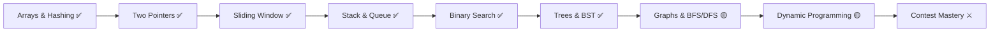

<!-- ⚠️ GENERATED FILE — edit scripts/README.template.md, then run: python scripts/build.py -->

<div align="center">


<br/>

<!-- LeetCode Official Profile & Solved Badges -->
<a href="https://leetcode.com/u/{{LEETCODE_USER}}/">
  
</a>
<a href="https://leetcode.com/u/{{LEETCODE_USER}}/">
  
</a>


<br/>

<!-- Streak, Contest Rating & Active Days -->


<br/><br/>

### 🎮 Player Profile & RPG Stats


<br/>

**Jump directly to:**
<a href="#streak-timeline"></a>
&nbsp;
<a href="#topic-matrix"></a>
&nbsp;
<a href="#achievements"></a>
&nbsp;
<a href="#scaffold-cli"></a>

</div>

<br/>

---

<a id="achievements"></a>

## 🏆 Achievements & Badges

| Badge | Title | Requirement | Status |
|:---:|:---|:---|:---:|
| 🛡️ | **Centurion** | Solve 100+ LeetCode problems | {{ACH_100}} |
| ⚔️ | **Double Centurion** | Solve 200+ LeetCode problems | {{ACH_200}} |
| 👑 | **Triple Centurion** | Solve 300+ LeetCode problems | {{ACH_300}} |
| 🔒 | **Five Hundred Club** | Solve 500+ LeetCode problems | {{ACH_500}} |
| 🔥 | **Habit Locked** | Maintain a 30-Day continuous streak | {{ACH_S30}} |
| ⚡ | **Pyromancer** | Maintain a 50-Day continuous streak | {{ACH_S50}} |
| 🌟 | **Century Flame** | Maintain a 100-Day continuous streak | {{ACH_S100}} |
| 🗄️ | **SQL Sorcerer** | Solve 15+ SQL problems & lessons | **UNLOCKED** ✅ |
| 🌲 | **Tree Whisperer** | Solve 15+ Tree & BST challenges | **UNLOCKED** ✅ |
| 🕸️ | **Graph Conqueror** | Solve 10+ Graph & Search algorithms | **UNLOCKED** ✅ |
| 🥊 | **Contest Gladiator** | Participate in 10+ official contests | **UNLOCKED** ✅ (14 contests) |

<br/>

### ⚔️ The Daily Creed
> *"We do not rise to the level of our goals, we fall to the level of our daily systems."*  
> **{{CURRENT}} consecutive days of practice.** One problem solved, one pattern mastered, one commit pushed.

### 🎯 Active Quests & Milestones
* 🗡️ **Daily Quest — Forge the Strike**: Solve at least 1 problem and push your code today. *(Reward: +25 EXP · Streak Shield)*
* 👹 **Weekly Boss — Contest Titan**: Compete in the official LeetCode Weekly / Biweekly Contest. *(Reward: +100 EXP · Rating Boost)*
* 🏆 **Epic Milestone — Triple Centurion**: Reach {{NEXT_MILESTONE}} problems solved (currently {{SOLVED}}/{{NEXT_MILESTONE}} · only {{REMAINING}} remaining!). *(Reward: +250 EXP · Title: Algorithm Warlord)*

<br/>

---

<a id="streak-timeline"></a>

## 🔥 Streak & 2026 Calendar


> 💡 **Streak Rule:** A day counts if at least one solution or algorithm lesson was written. Streaks and dates are synced in Indian Standard Time (IST).

### 📅 Chronological Timeline

All solutions are filed chronologically under `YYYY/MM-Month/DD-MM-YY/`. ↺ marks a revisit.

{{BY_DATE}}


<br/>

---

<a id="topic-matrix"></a>

## 🗂️ Algorithmic Patterns & Topic Matrix


### 📁 Repository Layout

{{TREE}}

### 🧠 Pattern Index

{{BY_TOPIC}}

<br/>

---

## 🧭 Roadmap



---

<a id="scaffold-cli"></a>

## ⚡ Add Today's Problem in 10 Seconds

Use `scripts/new.py` to automatically fetch the problem details from LeetCode, scaffold the file inside today's `dates/` directory, and regenerate this entire dashboard and all SVGs:

```bash
# By problem slug:
python scripts/new.py string-compression --lang py

# By problem number:
python scripts/new.py 200 --topic "Graphs & Search" --lang cpp

# Logging a revisit for an existing problem:
python scripts/new.py two-sum
```

`new.py` fetches the frontend ID, title, difficulty, and algorithm pattern from LeetCode GraphQL, places the file in `<year>/<month>/<day>/`, and updates your streak and RPG stats automatically!


<br/>

---

<div align="center">

<br/>

**Yogender** · Final Year AIML · LPU · [yogender1.me](https://yogender1.me) · [LeetCode @yashyogender](https://leetcode.com/u/{{LEETCODE_USER}}/)<br/>
<sub>"Consistency over intensity. One problem every single day."</sub>

</div>
